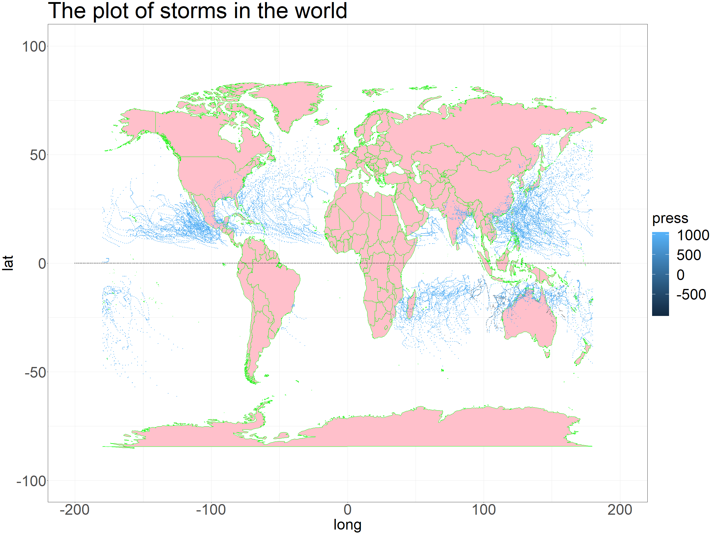
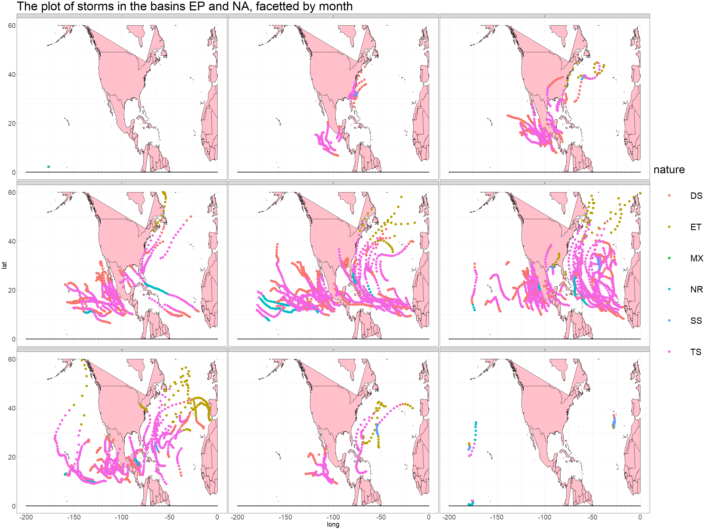

```{r setup, include=FALSE}
knitr::opts_chunk$set(echo = TRUE)
```

```{r,include=FALSE}
library("readr")
library("ggplot2")
library("dplyr")
library("lubridate")
```

## The report
<p>
Now we have got some data of storms happened from 2010 to 2015, Let's look for some interesting information by the analysis from them.
</p>

### The trajectories of all storms
We start by drawing a map of the trajectories of all storms to have an overview of them 

```{r echo=FALSE,fig.align='center'}

```

### The number of storms
<p>
First, let's analyse the number of the storms.
</p>

First of all, every one wants to know the number of storms happend in each year and how these number changed. Let's take a look at the table and the plot below. 
</p>

```{r,include=FALSE}
col_names <- c("serial_num","season","num","basin","sub_basin","name","iso_time","nature","latitude","longitude","wind","press")
#col_types <- c("character","integer","character","factor","character","character","character","character","real","real","real","real")
cols_types <- list( serial_Num = col_character(),
  season = col_integer(),
  num = col_integer(),
  basin = col_factor(),
  sub_basin = col_character(),
  name = col_character(),
  iso_time = col_character(),
  nature = col_character(),
  latitude = col_double(),
  longitude = col_double(),
  wind = col_double(),
  press = col_double())
dat <- read_csv("../data/ibtracs-2010-2015.csv ", na = c('-999','-1.0','0.0'),col_names = col_names,col_types = cols_types,skip = 2)
dat$press[dat$press==-999]=NA
```

```{r,echo=FALSE,comment=""}
serial_num_season <- distinct(select(dat,serial_num,season))
number_of_storms_year <- summarise(group_by(serial_num_season,season),count=n())
number_of_storms_year
ggplot(data = data.frame(number_of_storms_year),aes(x=season,y=count))+geom_line()+geom_point()+geom_text(aes(label=count),)+labs(title="the number of storms in each year")
```

<p>
From the graph, we see that, although with fluctuation, the tendency of the number is increase during this 6 years. 
</p>
<p>
Then, naturally, we want to ask whether the tendency also happened in each hemisphere?
</p>
```{r,echo=FALSE,comment=""}
serial_num_season_north <- distinct(select(filter(dat,latitude>0),serial_num,season))
number_of_storms_year_north <- summarise(group_by(serial_num_season_north,season),count=n())
number_of_storms_year_north <-  mutate(number_of_storms_year_north,sphere="north")

serial_num_season_south <- distinct(select(filter(dat,latitude<0),serial_num,season))
number_of_storms_year_south <- summarise(group_by(serial_num_season_south,season),count=n())
number_of_storms_year_south <- mutate(number_of_storms_year_south,sphere="south")
number_of_storms_year_sphere <-  rbind(number_of_storms_year_north,number_of_storms_year_south)

ggplot(data = data.frame(number_of_storms_year_sphere),aes(x=season,y=count,col=sphere))+geom_line()+geom_point()+geom_text(aes(label=count),)+labs(title="the number of storms in each hemishpere ")
```

<p>
From the graph, we see the line of north hemishpere is similar with the line of earth. The line of south, however, looks more plain except a decrease in 2012.
</p>
<p>
Also we could see the line of south part is always beneath that of north part. So we conclude that there were more storms in the north hemishpere.
</p>

<p>
Now, let's analyse more precisely and geographically.
</p>

<p>
We know that the frequency of storms has a lot of things to do with the climate, which has a lot of things to do the location. So we will explore whether the the numbers of storms in different basin were different.
</p>

```{r echo=FALSE,comment=""}
number_of_basin <- distinct(select(dat,serial_num,season,basin))
number_of_basin <- summarise(group_by(number_of_basin,season,basin),count=n())
ggplot(data=data.frame(number_of_basin),aes(x='content',y=count,fill=basin))+
  geom_bar(stat='identity',position = "stack")+
  facet_wrap(~season)+coord_polar(theta = "y")+
  labs(title = "The frequency of each basin",x="",y="")+
  theme(axis.text = element_blank())
```


<p>
From the plot, we find that the basin WP, NA and EP always happened in every year, and WP always had the most largest percentage.
</p>


<p>
Besides location, We also know that the climate of different month are totally different, so we guess that maybe we could find some regularites from this aspect.
</p>

```{r,echo=FALSE,comment=""}
dat_with_month <- distinct(select(mutate(dat,month_time=month(iso_time)),serial_num,season,month_time))
month_summarise <- summarise(group_by(dat_with_month,season,month_time),count=n())
ggplot(data = data.frame(month_summarise),aes(x=month_time,y=count))+geom_bar(stat="identity")+facet_wrap(~season,ncol=3)
```

<p>
Just as what we predict, there exist a pattern for the number of storms in different months. That is, most of the storms happened from July to October, and  the period between February and June had the least storms in a year.
</p>

<p>
So now, combining with pervious 2 parts, we draw a map of the storms of EP and NA basin, which is faceted by month and colored by its nature.
</p> 

```{r echo=FALSE,fig.align='center'}

```

<p>
Intuitively, we find most of their nature is TS and DS.
</p>

### The property of storms
<p>
Since we have talked a lot about the numebr, we will turn to the property of storms themselves. One of the things we concerned about is its duration.
</p>
```{r,echo=FALSE,comment=""}
duration_time <- select(dat,serial_num,name,iso_time)
duration_time <- summarise(group_by(duration_time,name,serial_num),start=min(iso_time),end=max(iso_time))
duration_time <- cbind(duration_time,duration=as.double(difftime(duration_time$end,duration_time$start,units="hours")),year=year(duration_time$start))
ggplot(data=data.frame(duration_time),aes(x=year,y=duration))+geom_boxplot(aes(group=year))

```
<p>
We could see that the range of the duration of storms are nearly the same, which means the duration of storms almost had no change from 2010 to 2015.
</p>

<p>
Now that there is no change in the duration, we turn to the pressure of the storms. We start by the extreme values of the pressure.
</p>

```{r,echo=FALSE,comment=""}
top_pressure <- summarise(group_by(dat,serial_num,name),pressure=max(press))
top_pressure <- top_pressure [!is.na(top_pressure$pressure),]
top_pressure <- arrange(top_pressure,desc(pressure))
head(top_pressure,10)
tail(top_pressure,10)
```

<p>
We see that the maximal pressure for a strom is always around 1000 during these five years. So we could conclude that the pressure of the storms had a little change in this period.
</p>

### The summary

<p>
From our analysis above, we find that the number of the storms was increasing while their pressure and duration didn't change a lot. So we conclude that we will face more and more stroms in the future, although they may not be more intensive, the increasing number will have more influence on our life.
</p>


