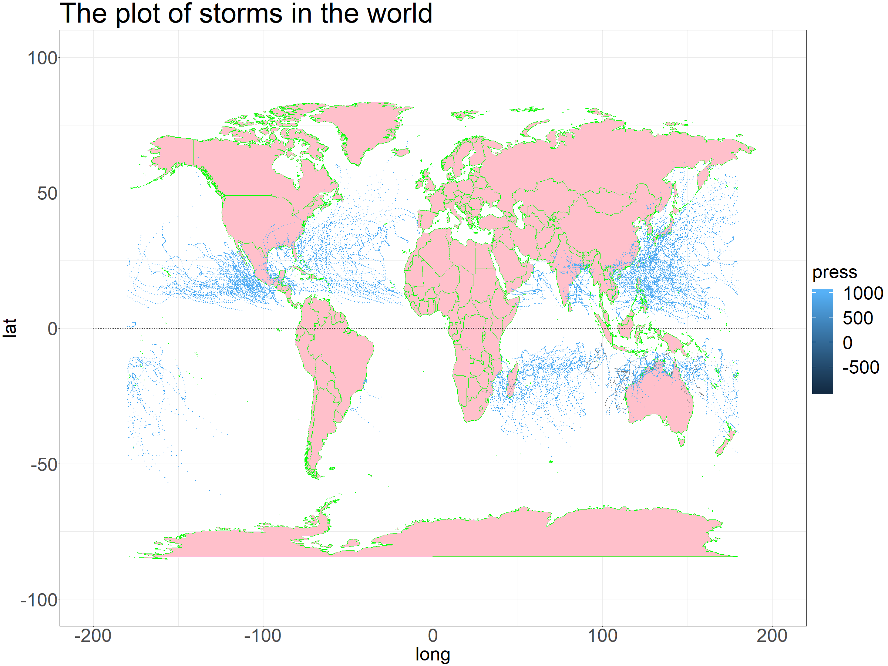

workout1-Jiale-Zha
================

## The report

Now we have got some data of storms happened from 2010 to 2015, Let’s
look for some interesting information by the analysis from them.

### The trajectories of all storms

We start by drawing a map of the trajectories of all storms to have an
overview of
them

### The number of storms

First, let’s analyse the number of the storms.

First of all, every one wants to know the number of storms happend in
each year and how these number changed. Let’s take a look at the table
and the plot below.

    # A tibble: 6 x 2
      season count
       <int> <int>
    1   2010    88
    2   2011    96
    3   2012    91
    4   2013   103
    5   2014    94
    6   2015   106

<!-- -->

From the graph, we see that, although with fluctuation, the tendency of
the number is increase during this 6 years.

Then, naturally, we want to ask whether the tendency also happened in
each hemisphere?

<!-- -->

From the graph, we see the line of north hemishpere is similar with the
line of earth. The line of south, however, looks more plain except a
decrease in 2012.

Also we could see the line of south part is always beneath that of north
part. So we conclude that there were more storms in the north
hemishpere.

Now, let’s analyse more precisely and geographically.

We know that the frequency of storms has a lot of things to do with the
climate, which has a lot of things to do the location. So we will
explore whether the the numbers of storms in different basin were
different.

<!-- -->

From the plot, we find that the basin WP, NA and EP always happened in
every year, and WP always had the most largest percentage.

Besides location, We also know that the climate of different month are
totally different, so we guess that maybe we could find some regularites
from this aspect.

<!-- -->

Just as what we predict, there exist a pattern for the number of storms
in different months. That is, most of the storms happened from July to
October, and the period between February and June had the least storms
in a year.

So now, combining with pervious 2 parts, we draw a map of the storms of
EP and NA basin, which is faceted by month and colored by its
nature.

Intuitively, we find most of their nature is TS and DS.

### The property of storms

Since we have talked a lot about the numebr, we will turn to the
property of storms themselves. One of the things we concerned about is
its duration.

<!-- -->

We could see that the range of the duration of storms are nearly the
same, which means the duration of storms almost had no change from 2010
to 2015.

Now that there is no change in the duration, we turn to the pressure of
the storms. We start by the extreme values of the pressure.

    # A tibble: 10 x 3
    # Groups:   serial_num [10]
       serial_num    name     pressure
       <chr>         <chr>       <dbl>
     1 2014180N32282 ARTHUR       1017
     2 2010263N15328 LISA         1016
     3 2011225N35294 FRANKLIN     1016
     4 2011239N27301 JOSE         1016
     5 2015126N27281 ANA          1016
     6 2010143S20035 JOEL         1015
     7 2011225N26302 GERT         1015
     8 2012246N29323 MICHAEL      1015
     9 2013093S08074 IMELDA       1015
    10 2013204N11340 DORIAN       1015

    # A tibble: 10 x 3
    # Groups:   serial_num [10]
       serial_num    name      pressure
       <chr>         <chr>        <dbl>
     1 2015216N23080 NOT NAMED      998
     2 2015259N20083 NOT NAMED      998
     3 2014164N18063 NOT NAMED      996
     4 2014216N22089 NOT NAMED      996
     5 2014019S26165 JUNE           995
     6 2011167N22089 NOT NAMED      994
     7 2015173N20067 NOT NAMED      994
     8 2011203N24084 NOT NAMED      992
     9 2014202N22086 NOT NAMED      992
    10 2015171N19086 NOT NAMED      992

We see that the maximal pressure for a strom is always around 1000
during these five years. So we could conclude that the pressure of the
storms had a little change in this period.

### The summary

From our analysis above, we find that the number of the storms was
increasing while their pressure and duration didn’t change a lot. So we
conclude that we will face more and more stroms in the future, although
they may not be more intensive, the increasing number will have more
influence on our life.

