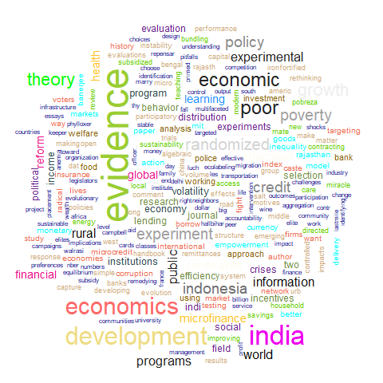
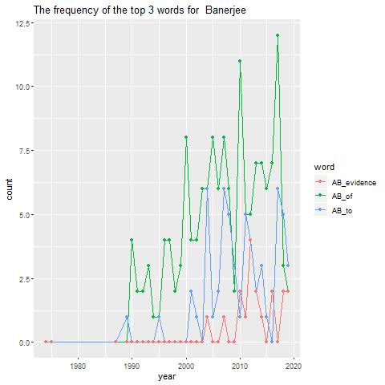

```{r setup, include=FALSE}
knitr::opts_chunk$set(echo = TRUE)
library(ggplot2)
library(rvest)
library(stringr)
library(dplyr)
library(wordcloud)
library(tm)
```

### This time, we find some data from Google Scholar, which is about some information of two economical Noble laureates, Abhijit Banerjee and Esther Duflo. We want to analyse some interesting fact about their publications.

### First, we sracp the data from web.

```{r}
Abhijit_Banerjee_html <- read_html("../data/rawdata/Abhijit_Banerjee_GoogleScholarCitations.html")
Esther_Duflo_html <- read_html("../data/rawdata/Esther_Duflo_GoogleScholarCitations.html")
Abhijit_Banerjee_table <- html_table(Abhijit_Banerjee_html)
Esther_Duflo_table <- html_table(Esther_Duflo_html)
AB_article <- Abhijit_Banerjee_table[[2]]
colnames(AB_article) <- AB_article[1,]
AB_article <- AB_article[-1,]
AB_citation <- AB_article[,2]
AB_citation[nchar(AB_citation) == 0] <- AB_citation[str_detect(AB_citation,"\\*")] <- str_remove(AB_citation[str_detect(AB_citation,"\\*")],"\\*")
AB_citation <- as.numeric(AB_citation)

AB_year <- AB_article[,3]
AB_year[nchar(AB_year) == 0] <- NA_character_ 

AB_researcher_journal <- Abhijit_Banerjee_html%>%
  html_nodes("div.gs_gray")%>%
  html_text()

AB_researcher <- AB_researcher_journal[seq(1,length(AB_researcher_journal),2)]
AB_journal <- AB_researcher_journal[seq(2,length(AB_researcher_journal),2)]
AB_researcher[nchar(AB_researcher)==0] <- NA_character_
AB_journal[nchar(AB_journal)==0] <- NA_character_ 


AB_title <- Abhijit_Banerjee_html%>%
  html_nodes(xpath = '//*[@class = "gsc_a_t"]')%>%
  html_nodes(css = "a")%>%
  html_text()
AB_title <- AB_title[-1]

AB_info <- data.frame(paperName = AB_title,
                      researcher = AB_researcher,
                      journal = AB_journal,
                      citation = AB_citation,
                      year = AB_year)

ED_article <- Esther_Duflo_table[[2]]
colnames(ED_article) <- ED_article[1,]
ED_article <- ED_article[-1,]
ED_citation <- ED_article[,2]
ED_citation[nchar(ED_citation) == 0] <- 0
ED_citation[str_detect(ED_citation,"\\*")] <- str_remove(ED_citation[str_detect(ED_citation,"\\*")],"\\*")
ED_citation <- as.numeric(ED_citation)

ED_year <- ED_article[,3]
ED_year[nchar(ED_year) == 0] <- NA_character_ 

ED_researcher_journal <- Esther_Duflo_html%>%
  html_nodes("div.gs_gray")%>%
  html_text()

ED_researcher <- ED_researcher_journal[seq(2,length(ED_researcher_journal),2)]
ED_journal <- ED_researcher_journal[seq(1,length(ED_researcher_journal),2)]
ED_researcher[nchar(ED_researcher)==0] <- NA_character_
ED_journal[nchar(ED_journal)==0] <- NA_character_ 
ED_journal <- ED_journal[-1]


ED_title <- Esther_Duflo_html%>%
  html_nodes(xpath = '//*[@class = "gsc_a_t"]')%>%
  html_nodes(css = "a")%>%
  html_text()
ED_title <- ED_title[-1]


ED_info <- data.frame(paperName = ED_title,
                      researcher = ED_researcher,
                      journal = ED_journal,
                      citation = ED_citation,
                      year = ED_year)

```


### Now, let us focus on the title of their papers.

### The first thing is about the begining words of the titles, we want to see that how many of them start with a vowel.


```{r}
AB_start_vowel <- length(AB_title[str_detect(AB_title,"^[AEIOU]")])
AB_start_vowel
ED_start_vowel <- length(ED_title[str_detect(ED_title,"^[AEIOU]")])
ED_start_vowel
```

### The results are shown above, it seems that Abhijit Banerjee perfer to start his papers' title with a vowel.

### After the first word, it's natural to ask about the last words of their papers' title. Now we just take the number of the title ending with "S" as an example. 

```{r}
AB_end_s <- length(AB_title[str_detect(AB_title,"s$")])
AB_end_s
ED_end_s <- length(ED_title[str_detect(ED_title,"s$")])
ED_end_s
```

### Again, Abhijit Banerjee gives more titles ending with "s"

### Next, let's turn to the length of the titles. We're curious about what the longest title looks like, so we find them for two scholars.

```{r}
AB_longest_title <- AB_title[which.max(nchar(AB_title))]
AB_longest_title
ED_longest_title <- ED_title[which.max(nchar(ED_title))]
ED_longest_title
```

### We see both of them are indeed very long.

### So having looked at something about the whole title, we are then interested in the component of the title. Let's take a look at the number of the punctuations in the titles. 

```{r}
AB_all_punct <- unlist(str_extract_all(AB_title,"[[:punct:]]"))
AB_all_punct_unique <- unique(AB_all_punct)
AB_punct_count <- c()
for(i in 1:length(AB_all_punct_unique)){
  counts <- sum(str_count(AB_all_punct,paste0("\\",AB_all_punct_unique[i])))
  AB_punct_count <- c(AB_punct_count, counts)
}
summary(AB_punct_count)
AB_punct_count <- data.frame(punctuation=AB_all_punct_unique,
                             counts=AB_punct_count)
AB_punct_count

ggplot(data = AB_punct_count,aes(x = punctuation, y = counts))+
  geom_histogram(stat = "identity")+
  labs(title = "punctuation symbols' count in A Banerjee's title")

ED_all_punct <- unlist(str_extract_all(ED_title,"[[:punct:]]"))
ED_all_punct_unique <- unique(ED_all_punct)
ED_punct_count <- c()
for(i in 1:length(ED_all_punct_unique)){
  counts <- sum(str_count(ED_all_punct,paste0("\\",ED_all_punct_unique[i])))
  ED_punct_count <- c(ED_punct_count, counts)
}
summary(ED_punct_count)
ED_punct_count <- data.frame(punctuation=ED_all_punct_unique,
                             counts = ED_punct_count)
ED_punct_count
ggplot(data = ED_punct_count,aes(x = punctuation, y = counts))+
  geom_histogram(stat = "identity")+
  labs(title = "punctuation symbols' count in E Duflo's title")
```

### Although they are just the titles, it seems that they contained all kinds of punctuations.

### Then let us consider about those meaningful words in their titles, so we remove the stopping words like "the", "a" and so on, also remove the numbers and the punctuations.

```{r}
stop_words <- c(" *[Tt]he "," *[Aa] "," *[Aa]n "," *[Aa]nd "," *[Ii]n "," *[Ii]f "," *[Bb]ut ")
AB_title_remove <- AB_title
for(i in stop_words){
  AB_title_remove <- str_replace_all(AB_title_remove,i, " ") 
}

AB_title_remove <- str_remove_all(AB_title_remove,"\\d+ *")
AB_title_remove <- str_remove_all(AB_title_remove,"[[:punct:]]+")

AB_title_remove <- str_replace_all(AB_title_remove,
                                   "^ ","")
head(AB_title_remove)

```


```{r}
ED_title_remove <- ED_title
for(i in stop_words){
  ED_title_remove <- str_replace_all(ED_title_remove,i, " ") 
}

ED_title_remove <- str_remove_all(ED_title_remove,"\\d+ *")
ED_title_remove <- str_remove_all(ED_title_remove,"[[:punct:]]+")

ED_title_remove <- str_replace_all(ED_title_remove,
                                   "^ ","")
head(ED_title_remove)

```

### We want to know the top 10 frequent words in the titles. In order to get the real count, we convert all the words to lower form first, then find the count.

```{r}
AB_title_all_words <- str_split(str_to_lower(AB_title_remove)," ")
AB_title_all_words <- unlist(AB_title_all_words)
AB_title_all_words_unique <- unique(AB_title_all_words)
AB_title_all_words_unique <- AB_title_all_words_unique[!(AB_title_all_words_unique == "")]
AB_words_counts <- c()
for(i in AB_title_all_words_unique){
  counts <- length(AB_title_all_words[AB_title_all_words==i])
  AB_words_counts <- c(AB_words_counts,counts)
}
AB_words_counts <- data.frame(words = AB_title_all_words_unique, counts = AB_words_counts)
AB_words_counts_top10 <- head(AB_words_counts[order(AB_words_counts[,2],decreasing = TRUE),],10)
AB_words_counts_top10
```


```{r}
ED_title_all_words <- str_split(str_to_lower(ED_title_remove)," ")
ED_title_all_words <- unlist(ED_title_all_words)
ED_title_all_words_unique <- unique(ED_title_all_words)
ED_title_all_words_unique <- ED_title_all_words_unique[!(ED_title_all_words_unique == "")]
ED_words_counts <- c()
for(i in ED_title_all_words_unique){
  counts <- length(ED_title_all_words[ED_title_all_words==i])
  ED_words_counts <- c(ED_words_counts,counts)
}
ED_words_counts <- data.frame(words = ED_title_all_words_unique, counts = ED_words_counts)
ED_words_counts_top10 <- head(ED_words_counts[order(ED_words_counts[,2],decreasing = TRUE),],10)
ED_words_counts_top10
```

### We see that the word "of" always appears most, and the words "evidence", "india", "economics" and "development" appear on both two results.

### Now, having worked a lot with the number, we turn to do some visualization and get facts more intuitive.

### First, let us have a direct look at all the words that are used in those titles, we create wordclouds for them.


```{r warning=F}
setwd("../images")
png(filename = "AB_title_wordcloud.png")
wordcloud(AB_title_all_words,colors = colors())
dev.off()
png(filename = "ED_title_wordcloud.png")
wordcloud(ED_title_all_words,colors = colors())
dev.off()
```

```{r echo=F, fig.align='center'}

knitr::include_graphics("../images/ED_title_wordcloud.png")
```

### Combining with the result of the top 10 frequent words in those titles, these tow wordclouds are easier to understand. And again, we see those words like "evidence", "economics" and so on.

### Then we also want to know the change of their frequencies over years, and since 10 words may looks too complicated, we only take the top 3 of them, and draw the line plot over years.

```{r}

AB_title_top3 <- AB_words_counts_top10[1:3,1]
AB_title_top3_year_counts <- data.frame(year = c(),
                                        count = c(),
                                        word = c())
for(i in AB_title_top3){
  top_counts <- data.frame(year = as.numeric(AB_year),
                           count = str_count(AB_title,
                                             paste0(" ",i," ")))
  top_counts <- filter(top_counts,!is.na(year))
  top_counts <- top_counts%>%
    group_by(year)%>%
    summarise(count = sum(count))
  top_counts[,"word"] = paste0("AB_",i)
  AB_title_top3_year_counts <- rbind(AB_title_top3_year_counts,
                                     top_counts)
}


ED_title_top3 <- ED_words_counts_top10[1:3,1]
ED_title_top3_year_counts <- data.frame(year = c(),
                                        count = c(),
                                        word = c())
for(i in ED_title_top3){
  top_counts <- data.frame(year = as.numeric(ED_year),
                           count = str_count(ED_title,
                                             paste0(" ",i," ")))
  top_counts <- filter(top_counts,!is.na(year))
  top_counts <- top_counts%>%
    group_by(year)%>%
    summarise(count = sum(count))
  top_counts[,"word"] = paste0("ED_",i)
  ED_title_top3_year_counts <- rbind(ED_title_top3_year_counts,
                                     top_counts)
}

top_counts <- rbind(AB_title_top3_year_counts,ED_title_top3_year_counts)
```


```{r warning=F}
setwd("../images")
png(filename = "AB_top3_frequency.png")
ggplot(AB_title_top3_year_counts, aes(x = year, y= count, col = word))+
  geom_line()+
  geom_point()+
  labs(title = "The frequency of the top 3 words for  Banerjee")
dev.off()
png(filename = "ED_top3_frequency.png")
ggplot(ED_title_top3_year_counts, aes(x = year, y= count, col = word))+
  geom_line()+
  geom_point()+
  labs(title = "The frequency of the top 3 words for E Duflo")
dev.off()
```

```{r echo=F, fig.align='center'}

knitr::include_graphics("../images/ED_top3_frequency.png")
```

### The pattern is not so obvious, for both scholars, the counts fluctuatue as the years change.

### Now, we have do a lot about the titles, we will turn to the years of publication. Again, we perfer something intuitive, so let's think about the number of publications every year.  

```{r}
setwd("../images")
AB_year_count <- data.frame(year = as.numeric(AB_year))%>%
  group_by(year)%>%
  summarise(count = n())
AB_year_count <- filter(AB_year_count,!(is.na(year)))
png(filename = "AB_publications.png")
ggplot(data = AB_year_count,aes(x = year,y = count))+
  geom_point()+
  geom_path(stat = "identity")+
  labs(title = "number of publications accross years for A Banerjee")
dev.off()
```

```{r}
setwd("../images")
ED_year_count <- data.frame(year = as.numeric(ED_year))%>%
  group_by(year)%>%
  summarise(count = n())
ED_year_count <- filter(ED_year_count,!(is.na(year)))
png(filename = "ED_publications.png")
ggplot(data = ED_year_count,aes(x = year,y = count))+
  geom_point()+
  geom_path(stat = "identity")+
  labs(title = "number of publications accross years for E Duflo")
dev.off()
```


```{r echo=F, fig.align='center'}
knitr::include_graphics("../images/AB_publications.png")
knitr::include_graphics("../images/ED_publications.png")
```

### the trends of two scholars are very similar. Before 2000, the publications for both of them are few, then it began to increase with some fluctuation, and finally got their summits after 2010.

### And now, only the reseacrchers and the journals have not been analysed， So we'll focus on them in the next question.

### First, we ask about which scholar get more help, that is which of them has more co-authors on average?

```{r}
AB_co_authors <- AB_researcher%>%
  str_split(",")%>%
  unlist()%>%
  str_remove_all("A[V]* Banerjee")
AB_co_authors <- AB_co_authors[!(AB_co_authors == "")]
AB_co_authors <- AB_co_authors[!str_detect(AB_co_authors,
                                           "[[:punct:]]+")]
AB_co_authors <- AB_co_authors[!(AB_co_authors == " ")]
AB_average_co_authors <- length(AB_co_authors)/length(AB_title)
AB_average_co_authors

ED_co_authors <- ED_researcher%>%
  str_split(",")%>%
  unlist()%>%
  str_remove_all("A[V]* Banerjee")
ED_co_authors <- ED_co_authors[!(ED_co_authors == "")]
ED_co_authors <- ED_co_authors[!str_detect(ED_co_authors,
                                           "[[:punct:]]+")]
ED_co_authors <- ED_co_authors[!(ED_co_authors == " ")]
ED_average_co_authors <- length(ED_co_authors)/length(ED_title)
ED_average_co_authors
```

### From the result above, we see that scholar E Duflo has `r ED_average_co_authors` co-authors per article, which is greater then that of A Banerjee. So he may get a bit more help from others. 

### So then which article has the most co-authors for them respectivevly? We will find the informationof that article. 

```{r}
AB_co_authors_resp <- AB_researcher%>%str_remove_all("A[V]* Banerjee,*")
AB_most_co_author <- AB_info[which.max(str_count(AB_co_authors_resp,",")),]
AB_most_co_author
ED_co_authors_resp <- ED_researcher%>%str_remove_all("E Duflo,*")
ED_most_co_author <- ED_info[which.max(str_count(ED_co_authors_resp,",")),]
ED_most_co_author
```

### After analysis facts above, let take a look at those who work with both of the two scholars. 

```{r}
AB_co_authors <- str_trim(AB_co_authors,side = "left")
ED_co_authors <- str_trim(ED_co_authors,side = "left")
mutual_authors <- intersect(AB_co_authors,ED_co_authors)
mutual_authors <- mutual_authors[!(str_detect(mutual_authors,"E Duflo"))& !(str_detect(mutual_authors,"A Banerjee"))]
mutual_authors
```


### We see a lot mutual friends of them, totaly 186. And that is reasonable since they are both economic scholar.

### As for the co-authors, it's natural to ask that are there any articles which are complished by them together? Let's find them

```{r}
filter(AB_info,str_detect(researcher,"E Duflo"))
filter(ED_info,str_detect(researcher,"A[V]* Banerjee"))
```

### It's a bit weird that scholar A Banerjee has more this kind of articles. 

### Anyway, the part about researchers ends, let's turn to the number of pages and the citations of their papers.

### The numner of pages is not given directly, so we need to find it.


```{r}
AB_page <- AB_journal%>%
  str_extract_all("[[:digit:]]+-[[:digit:]]+")%>%
  unlist
AB_citation_page <- AB_citation[str_detect(AB_journal,"[[:digit:]]+-[[:digit:]]+")]
AB_citation_page <- AB_citation_page[!is.na(AB_page)]
AB_page <- AB_page[!is.na(AB_page)]

AB_page_before <- AB_page%>%
  str_extract_all("[[:digit:]]+-")%>%
  str_remove_all("-")%>%
  as.numeric()
AB_page_after <- AB_page%>%
  str_extract_all("-[[:digit:]]+")%>%
  str_remove_all("-")%>%
  as.numeric()
AB_error_after <- AB_page_after[AB_page_after<AB_page_before]%>%
  as.character()
AB_error_before <- AB_page_before[AB_page_after<AB_page_before]%>%
  as.character()
AB_error_after <- AB_error_before%>%
  str_sub(1,nchar(AB_error_before)-nchar(AB_error_after))%>%
  paste0(AB_error_after)%>%
  as.numeric()
AB_page_after[AB_page_after<AB_page_before] <- AB_error_after
AB_pages_count <- AB_page_after-AB_page_before
AB_pages_count
```
```{r}
ED_page <- ED_journal%>%
  str_trim()%>%
  str_extract_all("[[:digit:]]+-[[:digit:]]+")%>%
  unlist
ED_citation_page <- ED_citation[str_detect(ED_journal,"[[:digit:]]+-[[:digit:]]+")]
ED_citation_page <- ED_citation_page[!is.na(ED_page)]
ED_page <- ED_page[!is.na(ED_page)]

ED_page_before <- ED_page%>%
  str_extract_all("[[:digit:]]+-")%>%
  str_remove_all("-")%>%
  as.numeric()
ED_page_after <- ED_page%>%
  str_extract_all("-[[:digit:]]+")%>%
  str_remove_all("-")%>%
  as.numeric()
ED_error_after <- ED_page_after[ED_page_after<ED_page_before]%>%
  as.character()
ED_error_before <- ED_page_before[ED_page_after<ED_page_before]%>%
  as.character()
ED_error_after <- ED_error_before%>%
  str_sub(1,nchar(ED_error_before)-nchar(ED_error_after))%>%
  paste0(ED_error_after)%>%
  as.numeric()
ED_page_after[ED_page_after<ED_page_before] <- ED_error_after
ED_pages_count <- ED_page_after-ED_page_before
ED_pages_count
```

### it's not a easy thing to find them, but we succeed!

### So let's see that whether hte pages and the times of citation have any correlatioin or not. We only consider those whose pages we have.


```{r}
AB_pages_count_citation <- AB_pages_count[!is.na(AB_citation_page)]
AB_citation_page <- AB_citation_page[!is.na(AB_citation_page)]
cor(AB_citation_page,AB_pages_count_citation)
```
```{r}
ED_pages_count_citation <- ED_pages_count[!is.na(ED_citation_page)]
ED_citation_page <- ED_citation_page[!is.na(ED_citation_page)]
cor(ED_citation_page,ED_pages_count_citation)
```

### We see that for both two scholars, the absolute value of the correlation coefficents of pages and the number of citations are very small, so it seems that they have no correlation.

### Finally, let's consider about the journals. We begin with the number of the distinct journals for two scholars. 

```{r}
AB_journal_name <- str_remove_all(AB_journal,"[[:digit:]]+")%>%
  str_remove_all("[-,()]")%>%
  str_trim("right")
AB_journal_name_unique <- unique(AB_journal_name)
length(unique(AB_journal_name))

ED_journal_name <- str_remove_all(ED_journal,"[[:digit:]]+")%>%
  str_remove_all("[-,()]")%>%
  str_trim("right")
ED_journal_name_unique <- unique(ED_journal_name)
length(unique(ED_journal_name))
```

### The number tells us more journal names appear in the table of A Banerjee.

### And we also find the total number of citations for each journal.

```{r}
AB_journal_ciation <- data.frame(name = AB_journal_name,
                                 citation = AB_citation)
AB_journal_ciation <- filter(AB_journal_ciation,
                             !is.na(name))
AB_citation_time <- AB_journal_ciation%>%
  group_by(name)%>%
  summarise(time = sum(citation,na.rm = TRUE))
AB_citation_time 
```
```{r}
ED_journal_ciation <- data.frame(name = ED_journal_name,
                                 citation = ED_citation)
ED_journal_ciation <- filter(ED_journal_ciation,
                             !is.na(name))
ED_citation_time <- ED_journal_ciation%>%
  group_by(name)%>%
  summarise(time = sum(citation,na.rm = TRUE))
ED_citation_time 
```

### According to the data above, we find the journal which cited most for two scholars respectively.

```{r}
AB_most_influ <- AB_citation_time[which.max(AB_citation_time$time),]
AB_most_influ
ED_most_influ <- ED_citation_time[which.max(ED_citation_time$time),]
ED_most_influ

```

### All the results are shown above.

### We'll end our report here

### Thank your!
