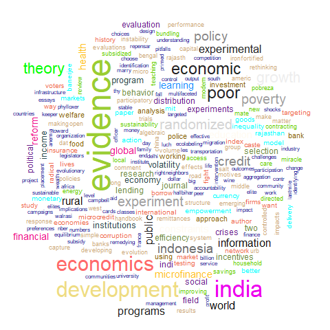
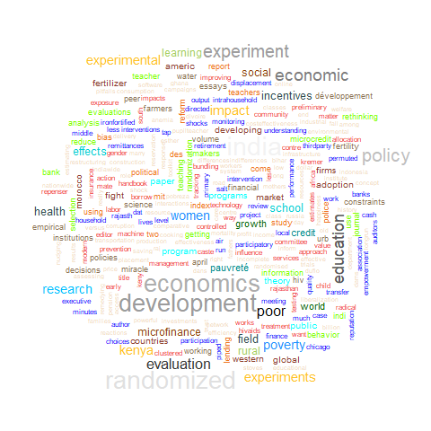
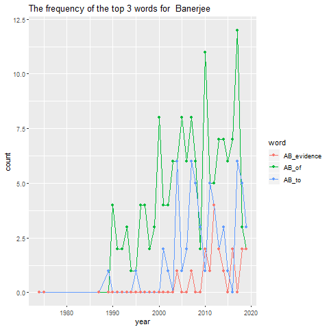
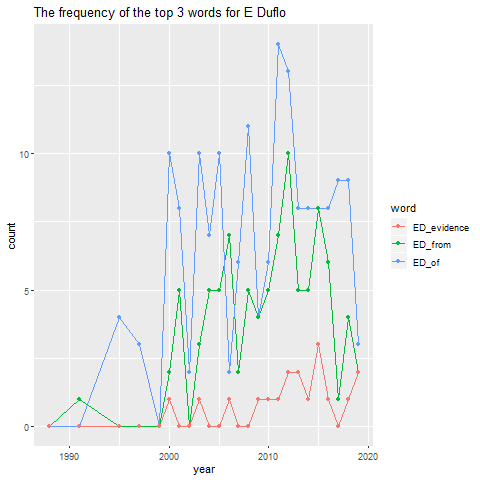
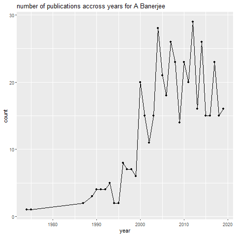
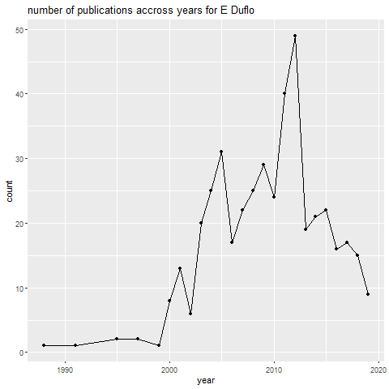

workout3-report
================

### This time, we find some data from Google Scholar, which is about some information of two economical Noble laureates, Abhijit Banerjee and Esther Duflo. We want to analyse some interesting fact about their publications.

### First, we sracp the data from web.

``` r
Abhijit_Banerjee_html <- read_html("../data/rawdata/Abhijit_Banerjee_GoogleScholarCitations.html")
Esther_Duflo_html <- read_html("../data/rawdata/Esther_Duflo_GoogleScholarCitations.html")
Abhijit_Banerjee_table <- html_table(Abhijit_Banerjee_html)
Esther_Duflo_table <- html_table(Esther_Duflo_html)
AB_article <- Abhijit_Banerjee_table[[2]]
colnames(AB_article) <- AB_article[1,]
AB_article <- AB_article[-1,]
AB_citation <- AB_article[,2]
AB_citation[nchar(AB_citation) == 0] <- AB_citation[str_detect(AB_citation,"\\*")] <- str_remove(AB_citation[str_detect(AB_citation,"\\*")],"\\*")
AB_citation <- as.numeric(AB_citation)

AB_year <- AB_article[,3]
AB_year[nchar(AB_year) == 0] <- NA_character_ 

AB_researcher_journal <- Abhijit_Banerjee_html%>%
  html_nodes("div.gs_gray")%>%
  html_text()

AB_researcher <- AB_researcher_journal[seq(1,length(AB_researcher_journal),2)]
AB_journal <- AB_researcher_journal[seq(2,length(AB_researcher_journal),2)]
AB_researcher[nchar(AB_researcher)==0] <- NA_character_
AB_journal[nchar(AB_journal)==0] <- NA_character_ 


AB_title <- Abhijit_Banerjee_html%>%
  html_nodes(xpath = '//*[@class = "gsc_a_t"]')%>%
  html_nodes(css = "a")%>%
  html_text()
AB_title <- AB_title[-1]

AB_info <- data.frame(paperName = AB_title,
                      researcher = AB_researcher,
                      journal = AB_journal,
                      citation = AB_citation,
                      year = AB_year)

ED_article <- Esther_Duflo_table[[2]]
colnames(ED_article) <- ED_article[1,]
ED_article <- ED_article[-1,]
ED_citation <- ED_article[,2]
ED_citation[nchar(ED_citation) == 0] <- 0
ED_citation[str_detect(ED_citation,"\\*")] <- str_remove(ED_citation[str_detect(ED_citation,"\\*")],"\\*")
ED_citation <- as.numeric(ED_citation)

ED_year <- ED_article[,3]
ED_year[nchar(ED_year) == 0] <- NA_character_ 

ED_researcher_journal <- Esther_Duflo_html%>%
  html_nodes("div.gs_gray")%>%
  html_text()

ED_researcher <- ED_researcher_journal[seq(2,length(ED_researcher_journal),2)]
ED_journal <- ED_researcher_journal[seq(1,length(ED_researcher_journal),2)]
ED_researcher[nchar(ED_researcher)==0] <- NA_character_
ED_journal[nchar(ED_journal)==0] <- NA_character_ 
ED_journal <- ED_journal[-1]


ED_title <- Esther_Duflo_html%>%
  html_nodes(xpath = '//*[@class = "gsc_a_t"]')%>%
  html_nodes(css = "a")%>%
  html_text()
ED_title <- ED_title[-1]


ED_info <- data.frame(paperName = ED_title,
                      researcher = ED_researcher,
                      journal = ED_journal,
                      citation = ED_citation,
                      year = ED_year)
```

### Now, let us focus on the title of their papers.

### The first thing is about the begining words of the titles, we want to see that how many of them start with a vowel.

``` r
AB_start_vowel <- length(AB_title[str_detect(AB_title,"^[AEIOU]")])
AB_start_vowel
```

    ## [1] 118

``` r
ED_start_vowel <- length(ED_title[str_detect(ED_title,"^[AEIOU]")])
ED_start_vowel
```

    ## [1] 116

### The results are shown above, it seems that Abhijit Banerjee perfer to start his papers’ title with a vowel.

### After the first word, it’s natural to ask about the last words of their papers’ title. Now we just take the number of the title ending with “S” as an example.

``` r
AB_end_s <- length(AB_title[str_detect(AB_title,"s$")])
AB_end_s
```

    ## [1] 78

``` r
ED_end_s <- length(ED_title[str_detect(ED_title,"s$")])
ED_end_s
```

    ## [1] 74

### Again, Abhijit Banerjee gives more titles ending with “s”

### Next, let’s turn to the length of the titles. We’re curious about what the longest title looks like, so we find them for two scholars.

``` r
AB_longest_title <- AB_title[which.max(nchar(AB_title))]
AB_longest_title
```

    ## [1] "Voters be Primed to Choose Better Legislators? Experimental Evidence from Rural India,” October 2010. mimeo, Harvard Universiy. 4, 27, 29, Selvan Kumar, Rohini Pande, and Felix<U+00A0>…"

``` r
ED_longest_title <- ED_title[which.max(nchar(ED_title))]
ED_longest_title
```

    ## [1] "Controlling the costs of HIV/AIDS management--unique management software to empower organisations to formulate and implement strategies best suited for their specific requirements."

### We see both of them are indeed very long.

### So having looked at something about the whole title, we are then interested in the component of the title. Let’s take a look at the number of the punctuations in the titles.

``` r
AB_all_punct <- unlist(str_extract_all(AB_title,"[[:punct:]]"))
AB_all_punct_unique <- unique(AB_all_punct)
AB_punct_count <- c()
for(i in 1:length(AB_all_punct_unique)){
  counts <- sum(str_count(AB_all_punct,paste0("\\",AB_all_punct_unique[i])))
  AB_punct_count <- c(AB_punct_count, counts)
}
summary(AB_punct_count)
```

    ##    Min. 1st Qu.  Median    Mean 3rd Qu.    Max. 
    ##    1.00    2.00    6.50   31.23   21.50  247.00

``` r
AB_punct_count <- data.frame(punctuation=AB_all_punct_unique,
                             counts=AB_punct_count)
AB_punct_count
```

    ##    punctuation counts
    ## 1            :    160
    ## 2            ?     61
    ## 3            ,    247
    ## 4            '     14
    ## 5            -     79
    ## 6            –      2
    ## 7            .    113
    ## 8            [      5
    ## 9            ]      5
    ## 10           (     25
    ## 11           )     24
    ## 12           &      4
    ## 13           “     10
    ## 14           ”     11
    ## 15           ’     14
    ## 16           "     12
    ## 17           ‘      5
    ## 18           …      8
    ## 19           /      3
    ## 20          「      2
    ## 21          」      2
    ## 22           —      1
    ## 23           *      1
    ## 24           ;      2
    ## 25    <U+00BF>      1
    ## 26           !      1

``` r
ggplot(data = AB_punct_count,aes(x = punctuation, y = counts))+
  geom_histogram(stat = "identity")+
  labs(title = "punctuation symbols' count in A Banerjee's title")
```

    ## Warning: Ignoring unknown parameters: binwidth, bins, pad

<!-- -->

``` r
ED_all_punct <- unlist(str_extract_all(ED_title,"[[:punct:]]"))
ED_all_punct_unique <- unique(ED_all_punct)
ED_punct_count <- c()
for(i in 1:length(ED_all_punct_unique)){
  counts <- sum(str_count(ED_all_punct,paste0("\\",ED_all_punct_unique[i])))
  ED_punct_count <- c(ED_punct_count, counts)
}
summary(ED_punct_count)
```

    ##    Min. 1st Qu.  Median    Mean 3rd Qu.    Max. 
    ##     1.0     2.0     7.0    28.0    20.5   221.0

``` r
ED_punct_count <- data.frame(punctuation=ED_all_punct_unique,
                             counts = ED_punct_count)
ED_punct_count
```

    ##    punctuation counts
    ## 1            -     76
    ## 2            ?     65
    ## 3            :    221
    ## 4            ‐      1
    ## 5            ,    159
    ## 6            ’     16
    ## 7            '     14
    ## 8            &      7
    ## 9            –      3
    ## 10           "      6
    ## 11           /     16
    ## 12           [      2
    ## 13           ]      2
    ## 14           .     72
    ## 15           (     25
    ## 16           )     26
    ## 17           “     12
    ## 18           ”     12
    ## 19           …      7
    ## 20           ;      1
    ## 21           ‘      3
    ## 22           *      3
    ## 23          「      2
    ## 24          」      2
    ## 25           _      1
    ## 26           @      1
    ## 27           !      1

``` r
ggplot(data = ED_punct_count,aes(x = punctuation, y = counts))+
  geom_histogram(stat = "identity")+
  labs(title = "punctuation symbols' count in E Duflo's title")
```

    ## Warning: Ignoring unknown parameters: binwidth, bins, pad

<!-- -->

### Although they are just the titles, it seems that they contained all kinds of punctuations.

### Then let us consider about those meaningful words in their titles, so we remove the stopping words like “the”, “a” and so on, also remove the numbers and the punctuations.

``` r
stop_words <- c(" *[Tt]he "," *[Aa] "," *[Aa]n "," *[Aa]nd "," *[Ii]n "," *[Ii]f "," *[Bb]ut ")
AB_title_remove <- AB_title
for(i in stop_words){
  AB_title_remove <- str_replace_all(AB_title_remove,i, " ") 
}

AB_title_remove <- str_remove_all(AB_title_remove,"\\d+ *")
AB_title_remove <- str_remove_all(AB_title_remove,"[[:punct:]]+")

AB_title_remove <- str_replace_all(AB_title_remove,
                                   "^ ","")
head(AB_title_remove)
```

    ## [1] "simple model of herd behavior"                                   
    ## [2] "Occupational choice process of development"                      
    ## [3] "Poor economics radical rethinking of way to fight global poverty"
    ## [4] "miracle of microfinance Evidence from randomized evaluation"     
    ## [5] "economic lives of poor"                                          
    ## [6] "Inequality growth What c dat say"

``` r
ED_title_remove <- ED_title
for(i in stop_words){
  ED_title_remove <- str_replace_all(ED_title_remove,i, " ") 
}

ED_title_remove <- str_remove_all(ED_title_remove,"\\d+ *")
ED_title_remove <- str_remove_all(ED_title_remove,"[[:punct:]]+")

ED_title_remove <- str_replace_all(ED_title_remove,
                                   "^ ","")
head(ED_title_remove)
```

    ## [1] "How much should we trust differencesindifferences estimates"                                                 
    ## [2] "Poor economics radical rethinking of way to fight global poverty"                                            
    ## [3] "Schooling labor market consequences of school construction Indonesia Evidence from unusual policy experiment"
    ## [4] "miracle of microfinance Evidence from randomized evaluation"                                                 
    ## [5] "Grandmothers granddaughters oldage pensions intrahousehold allocation South Africa"                          
    ## [6] "economic lives of poor"

### We want to know the top 10 frequent words in the titles. In order to get the real count, we convert all the words to lower form first, then find the count.

``` r
AB_title_all_words <- str_split(str_to_lower(AB_title_remove)," ")
AB_title_all_words <- unlist(AB_title_all_words)
AB_title_all_words_unique <- unique(AB_title_all_words)
AB_title_all_words_unique <- AB_title_all_words_unique[!(AB_title_all_words_unique == "")]
AB_words_counts <- c()
for(i in AB_title_all_words_unique){
  counts <- length(AB_title_all_words[AB_title_all_words==i])
  AB_words_counts <- c(AB_words_counts,counts)
}
AB_words_counts <- data.frame(words = AB_title_all_words_unique, counts = AB_words_counts)
AB_words_counts_top10 <- head(AB_words_counts[order(AB_words_counts[,2],decreasing = TRUE),],10)
AB_words_counts_top10
```

    ##           words counts
    ## 3            of    174
    ## 15           to     67
    ## 21     evidence     67
    ## 22         from     67
    ## 37        india     46
    ## 9   development     42
    ## 120         for     41
    ## 11    economics     38
    ## 10         poor     28
    ## 25     economic     28

``` r
ED_title_all_words <- str_split(str_to_lower(ED_title_remove)," ")
ED_title_all_words <- unlist(ED_title_all_words)
ED_title_all_words_unique <- unique(ED_title_all_words)
ED_title_all_words_unique <- ED_title_all_words_unique[!(ED_title_all_words_unique == "")]
ED_words_counts <- c()
for(i in ED_title_all_words_unique){
  counts <- length(ED_title_all_words[ED_title_all_words==i])
  ED_words_counts <- c(ED_words_counts,counts)
}
ED_words_counts <- data.frame(words = ED_title_all_words_unique, counts = ED_words_counts)
ED_words_counts_top10 <- head(ED_words_counts[order(ED_words_counts[,2],decreasing = TRUE),],10)
ED_words_counts_top10
```

    ##           words counts
    ## 12           of    179
    ## 26         from    102
    ## 25     evidence     98
    ## 14           to     79
    ## 141         for     57
    ## 47        india     53
    ## 32   randomized     52
    ## 9     economics     49
    ## 49  development     48
    ## 147          on     36

### We see that the word “of” always appears most, and the words “evidence”, “india”, “economics” and “development” appear on both two results.

### Now, having worked a lot with the number, we turn to do some visualization and get facts more intuitive.

### First, let us have a direct look at all the words that are used in those titles, we create wordclouds for them.

``` r
setwd("../images")
png(filename = "AB_title_wordcloud.png")
wordcloud(AB_title_all_words,colors = colors())
dev.off()
```

    ## png 
    ##   2

``` r
png(filename = "ED_title_wordcloud.png")
wordcloud(ED_title_all_words,colors = colors())
dev.off()
```

    ## png 
    ##   2



### Combining with the result of the top 10 frequent words in those titles, these tow wordclouds are easier to understand. And again, we see those words like “evidence”, “economics” and so on.

### Then we also want to know the change of their frequencies over years, and since 10 words may looks too complicated, we only take the top 3 of them, and draw the line plot over years.

``` r
AB_title_top3 <- AB_words_counts_top10[1:3,1]
AB_title_top3_year_counts <- data.frame(year = c(),
                                        count = c(),
                                        word = c())
for(i in AB_title_top3){
  top_counts <- data.frame(year = as.numeric(AB_year),
                           count = str_count(AB_title,
                                             paste0(" ",i," ")))
  top_counts <- filter(top_counts,!is.na(year))
  top_counts <- top_counts%>%
    group_by(year)%>%
    summarise(count = sum(count))
  top_counts[,"word"] = paste0("AB_",i)
  AB_title_top3_year_counts <- rbind(AB_title_top3_year_counts,
                                     top_counts)
}


ED_title_top3 <- ED_words_counts_top10[1:3,1]
ED_title_top3_year_counts <- data.frame(year = c(),
                                        count = c(),
                                        word = c())
for(i in ED_title_top3){
  top_counts <- data.frame(year = as.numeric(ED_year),
                           count = str_count(ED_title,
                                             paste0(" ",i," ")))
  top_counts <- filter(top_counts,!is.na(year))
  top_counts <- top_counts%>%
    group_by(year)%>%
    summarise(count = sum(count))
  top_counts[,"word"] = paste0("ED_",i)
  ED_title_top3_year_counts <- rbind(ED_title_top3_year_counts,
                                     top_counts)
}

top_counts <- rbind(AB_title_top3_year_counts,ED_title_top3_year_counts)
```

``` r
setwd("../images")
png(filename = "AB_top3_frequency.png")
ggplot(AB_title_top3_year_counts, aes(x = year, y= count, col = word))+
  geom_line()+
  geom_point()+
  labs(title = "The frequency of the top 3 words for  Banerjee")
dev.off()
```

    ## png 
    ##   2

``` r
png(filename = "ED_top3_frequency.png")
ggplot(ED_title_top3_year_counts, aes(x = year, y= count, col = word))+
  geom_line()+
  geom_point()+
  labs(title = "The frequency of the top 3 words for E Duflo")
dev.off()
```

    ## png 
    ##   2



### The pattern is not so obvious, for both scholars, the counts fluctuatue as the years change.

### Now, we have do a lot about the titles, we will turn to the years of publication. Again, we perfer something intuitive, so let’s think about the number of publications every year.

``` r
setwd("../images")
AB_year_count <- data.frame(year = as.numeric(AB_year))%>%
  group_by(year)%>%
  summarise(count = n())
AB_year_count <- filter(AB_year_count,!(is.na(year)))
png(filename = "AB_publications.png")
ggplot(data = AB_year_count,aes(x = year,y = count))+
  geom_point()+
  geom_path(stat = "identity")+
  labs(title = "number of publications accross years for A Banerjee")
dev.off()
```

    ## png 
    ##   2

``` r
setwd("../images")
ED_year_count <- data.frame(year = as.numeric(ED_year))%>%
  group_by(year)%>%
  summarise(count = n())
ED_year_count <- filter(ED_year_count,!(is.na(year)))
png(filename = "ED_publications.png")
ggplot(data = ED_year_count,aes(x = year,y = count))+
  geom_point()+
  geom_path(stat = "identity")+
  labs(title = "number of publications accross years for E Duflo")
dev.off()
```

    ## png 
    ##   2



### the trends of two scholars are very similar. Before 2000, the publications for both of them are few, then it began to increase with some fluctuation, and finally got their summits after 2010.

### And now, only the reseacrchers and the journals have not been analysed， So we’ll focus on them in the next question.

### First, we ask about which scholar get more help, that is which of them has more co-authors on average?

``` r
AB_co_authors <- AB_researcher%>%
  str_split(",")%>%
  unlist()%>%
  str_remove_all("A[V]* Banerjee")
AB_co_authors <- AB_co_authors[!(AB_co_authors == "")]
AB_co_authors <- AB_co_authors[!str_detect(AB_co_authors,
                                           "[[:punct:]]+")]
AB_co_authors <- AB_co_authors[!(AB_co_authors == " ")]
AB_average_co_authors <- length(AB_co_authors)/length(AB_title)
AB_average_co_authors
```

    ## [1] 2.480808

``` r
ED_co_authors <- ED_researcher%>%
  str_split(",")%>%
  unlist()%>%
  str_remove_all("A[V]* Banerjee")
ED_co_authors <- ED_co_authors[!(ED_co_authors == "")]
ED_co_authors <- ED_co_authors[!str_detect(ED_co_authors,
                                           "[[:punct:]]+")]
ED_co_authors <- ED_co_authors[!(ED_co_authors == " ")]
ED_average_co_authors <- length(ED_co_authors)/length(ED_title)
ED_average_co_authors
```

    ## [1] 2.784114

### From the result above, we see that scholar E Duflo has 2.7841141 co-authors per article, which is greater then that of A Banerjee. So he may get a bit more help from others.

### So then which article has the most co-authors for them respectivevly? We will find the informationof that article.

``` r
AB_co_authors_resp <- AB_researcher%>%str_remove_all("A[V]* Banerjee,*")
AB_most_co_author <- AB_info[which.max(str_count(AB_co_authors_resp,",")),]
AB_most_co_author
```

    ##                     paperName
    ## 301 Russia’s Phony Capitalism
    ##                                                                   researcher
    ## 301 R Das, R Das, R Das, R Das, R Das, R Das, B Bhattacharya, S Yechury, ...
    ##                                                                                        journal
    ## 301 Neoliberalism and the Transforming Left in India: A Contradictory Manifesto<U+00A0>…, 2018
    ##     citation year
    ## 301        3 2018

``` r
ED_co_authors_resp <- ED_researcher%>%str_remove_all("E Duflo,*")
ED_most_co_author <- ED_info[which.max(str_count(ED_co_authors_resp,",")),]
ED_most_co_author
```

    ##                                                                                  paperName
    ## 288 ‘Beating the Odds’ versus ‘Changing the Odds’: Poverty, Resilience, and Family Policy.
    ##                                                                   researcher
    ## 288 S Rajasekaran, J Reyes, J Pan, JF Zaff, AE Donlan, M Ungar, M Ungar, ...
    ##                                                                                        journal
    ## 288 The Victoria Institute for Education, Diversity and Lifelong Learning 27 (4<U+00A0>…, 2019
    ##     citation year
    ## 288        0 2019

### After analysis facts above, let take a look at those who work with both of the two scholars.

``` r
AB_co_authors <- str_trim(AB_co_authors,side = "left")
ED_co_authors <- str_trim(ED_co_authors,side = "left")
mutual_authors <- intersect(AB_co_authors,ED_co_authors)
mutual_authors <- mutual_authors[!(str_detect(mutual_authors,"E Duflo"))& !(str_detect(mutual_authors,"A Banerjee"))]
mutual_authors
```

    ##   [1] "R Glennerster"      "C Kinnan"           "S Cole"            
    ##   [4] "L Linden"           "T Besley"           "AG Chandrasekhar"  
    ##   [7] "MO Jackson"         "M Ghatak"           "N Qian"            
    ##  [10] "D Karlan"           "J Zinman"           "R Banerji"         
    ##  [13] "S Khemani"          "N Goldberg"         "R Osei"            
    ##  [16] "W Parienté"         "J Shapiro"          "S Galiani"         
    ##  [19] "S Mullainathan"     "D Kothari"          "R Hanna"           
    ##  [22] "R Pande"            "A Deaton"           "K Munshi"          
    ##  [25] "T Watts"            "J Lafortune"        "AP Zwane"          
    ##  [28] "E Van Dusen"        "W Pariente"         "C Null"            
    ##  [31] "E Miguel"           "K Rogoff"           "R Benabou"         
    ##  [34] "M Bertrand"         "R Hornbeck"         "R Chattopadhyay"   
    ##  [37] "P Bardhan"          "K Basu"             "J Berry"           
    ##  [40] "H Kannan"           "S Mukerji"          "M Shotland"        
    ##  [43] "D Keniston"         "N Singh"            "E Breza"           
    ##  [46] "M Kremer"           "S Chassang"         "D Kenniston"       
    ##  [49] "C Imbert"           "S Mathew"           "S Mukherji"        
    ##  [52] "D Acemoglu"         "S Johnson"          "S Barnhardt"       
    ##  [55] "M Jackson"          "M Walton"           "JM Gueron"         
    ##  [58] "S Athey"            "GW Imbens"          "CG Kinnan"         
    ##  [61] "E Field"            "A Khwaja"           "JD Angrist"        
    ##  [64] "D Card"             "C Udry"             "B Olken"           
    ##  [67] "V Abhijit"          "t"                  "E Dufio"           
    ##  [70] "A Delacourte"       "WTD Acemoglu"       "MG Dastidar"       
    ##  [73] "A BANERJEE"         "A Finkelstein"      "SA Cole"           
    ##  [76] "JA Robinson"        "S Rajasekaran"      "J Reyes"           
    ##  [79] "J Pan"              "JF Zaff"            "AE Donlan"         
    ##  [82] "M Ungar"            "R Adams"            "P Lillrank"        
    ##  [85] "J Aherne"           "A Whelton"          "B Balkenhol"       
    ##  [88] "GA Akerlof"         "DAH Alamgir"        "B Armendariz"      
    ##  [91] "J Morduch"          "TS Rabie"           "SN Towfighian"     
    ##  [94] "C Clark"            "M Cammett"          "C Bai"             
    ##  [97] "Q Zhang"            "X Fei"              "J Zhao"            
    ## [100] "M Wang"             "M Abramovitz"       "D Aigner"          
    ## [103] "FB Aboagye"         "DA Román Cedillo"   "R Abdulgani"       
    ## [106] "I Abu Bakar"        "J Robinson"         "R Abdelal"         
    ## [109] "MR Abouharb"        "D Cingranelli"      "ME Konomi"         
    ## [112] "MT Dattilo"         "MB Shuster"         "D Donaldson"       
    ## [115] "T Abdel Aziz"       "G Berg"             "M Abreu"           
    ## [118] "V Mendes"           "M Pezzini"          "AV BANERJEE"       
    ## [121] "E DUFLO"            "C JUMA"             "JL ROCCA"          
    ## [124] "D RIEFF"            "CO GRADA"           "H Aaron"           
    ## [127] "JT Abaluck"         "JH Abbring"         "J Ameriks"         
    ## [130] "C Azzi"             "PB Bach"            "LC Baker"          
    ## [133] "CRK Ahortor"        "P Acosta"           "C Calderon"        
    ## [136] "P Fajnzylber"       "H Lopez"            "M Chavan"          
    ## [139] "DE Adenutsi"        "PA Acosta"          "EKK Lartey"        
    ## [142] "FS Mandelman"       "P Diamond"          "J Kounouwewa"      
    ## [145] "D Chao"             "R Almeida"          "P Carneiro"        
    ## [148] "E Aryeetey"         "A Alesina"          "RJ Barro"          
    ## [151] "I Morris"           "D Emilson Adenutsi" "RH Adams Jr"       
    ## [154] "J Page"             "C Snyder"           "F Mashwama"        
    ## [157] "S Baird"            "J Hicks"            "WAW Learning"      
    ## [160] "H David"            "JC Aker"            "IM Mbiti"          
    ## [163] "JS Pischke"         "AJ Auerbach"        "M Mostagir"        
    ## [166] "A Ozdaglar"         "D Laibson"          "JA List"           
    ## [169] "S Anderson"         "M Baker"            "J Wurgler"         
    ## [172] "E Basker"           "S Paris"            "M MARUANI"         
    ## [175] "M MERON"            "MG Duggan"          "RM McCleary"       
    ## [178] "G Bel"              "A GALEOTTI"         "BW ROGERS"         
    ## [181] "M GHATAK"           "FZ Ahmed"           "E Werker"          
    ## [184] "KB Anderson"        "E Durbin"           "A Michael"

### We see a lot mutual friends of them, totaly 186. And that is reasonable since they are both economic scholar.

### As for the co-authors, it’s natural to ask that are there any articles which are complished by them together? Let’s find them

``` r
filter(AB_info,str_detect(researcher,"E Duflo"))
```

    ##                                                                                                                                                                                 paperName
    ## 1                                                                                                                 Poor economics: A radical rethinking of the way to fight global poverty
    ## 2                                                                                                                      The miracle of microfinance? Evidence from a randomized evaluation
    ## 3                                                                                                                                                          The economic lives of the poor
    ## 4                                                                                                                                           Inequality and growth: What can the data say?
    ## 5                                                                                                                  Remedying education: Evidence from two randomized experiments in India
    ## 6                                                                                                                                 Growth theory through the lens of development economics
    ## 7                                                                                                                                                           The diffusion of microfinance
    ## 8                                                                                                                         What is middle class about the middle classes around the world?
    ## 9                                                                                               Do firms want to borrow more? Testing credit constraints using a directed lending program
    ## 10                                                                                              Reputation effects and the limits of contracting: A study of the Indian software industry
    ## 11                                                                                                      On the road: Access to transportation infrastructure and economic growth in China
    ## 12                                                                                                                                     The experimental approach to development economics
    ## 13                                                                                        Pitfalls of participatory programs: Evidence from a randomized evaluation in education in India
    ## 14                                                                                          A multifaceted program causes lasting progress for the very poor: Evidence from six countries
    ## 15                                                                                                                                                                     Addressing absence
    ## 16                                       Improving immunisation coverage in rural India: clustered randomised controlled evaluation of immunisation campaigns with and without incentives
    ## 17                                                                                                                                 Wealth, health, and health services in rural Rajasthan
    ## 18                                                                                          Putting a band-aid on a corpse: incentives for nurses in the Indian public health care system
    ## 19                                                                                             Long-run health impacts of income shocks: Wine and phylloxera in nineteenth-century France
    ## 20                                                                                                                               Marry for what? Caste and mate selection in modern India
    ## 21                                                                                                                                                Health care delivery in rural Rajasthan
    ## 22                                                                                                                                                          Giving credit where it is due
    ## 23                                                                                                                            Gossip: Identifying central individuals in a social network
    ## 24                                                                                                                                                            The miracle of microfinance
    ## 25                                                                                                                                                                         Poor economics
    ## 26                                                                                                                                                                Banking reform in India
    ## 27                                                            Poor Economics: Barefoot Hedge-fund Managers, DIY Doctors and the Surprising Truth about Life on Less Than 1 [dollar] a Day
    ## 28                                                                                                                                                                Bank financing in India
    ## 29                                                                                                                                                                   Repenser la pauvreté
    ## 30                                                                           Bundling health insurance and microfinance in India: There cannot be adverse selection if there is no demand
    ## 31                                                                                                               Institute for Financial Management and Research Centre for Micro Finance
    ## 32                                                                                              From proof of concept to scalable policies: challenges and solutions, with an application
    ## 33                                                                                                                                                        The (mis) allocation of capital
    ## 34                                                                              Can institutions be reformed from within? Evidence from a randomized experiment with the Rajasthan police
    ## 35                                                                                             Do credit constraints limit entrepreneurship? Heterogeneity in the returns to microfinance
    ## 36                                                                                                                                                           Do firms want to borrow more
    ## 37                                                                                                                                Poor economics: rethinking poverty & the ways to end it
    ## 38                                                                                                                                  L'approche expérimentale en économie du développement
    ## 39                                                                Improving police performance in Rajasthan, India: Experimental evidence on incentives, managerial autonomy and training
    ## 40                                                         Can information campaigns spark local participation and improve outcomes? A study of primary education in Uttar Pradesh, India
    ## 41                                                                                                                      Computer-assisted learning: Evidence from a randomized experiment
    ## 42                                                                                                                                    (Dis) organization and Success in an Economics MOOC
    ## 43                                                                                                                                                         The economic lives of the poor
    ## 44                                                                                                          Repensar la pobreza: un giro radical en la lucha contra la desigualdad global
    ## 45                                                                                                Can information campaigns raise awareness and local participation in primary education?
    ## 46                                                        E-governance, accountability, and leakage in public programs: Experimental evidence from a financial management reform in india
    ## 47                                                                                                                     Mandated empowerment: handing antipoverty policy back to the poor?
    ## 48                                                                                                                                     More than 1 billion people are hungry in the world
    ## 49                                                                Mainstreaming an effective intervention: Evidence from randomized evaluations of “Teaching at the Right Level” in India
    ## 50                                                                                                                                                                    Repensar la pobreza
    ## 51                                                                                                            Under the Thumb of History? Political institutions and the Scope for Action
    ## 52                                                                                                                         The nature of credit constraints: Evidence from an Indian bank
    ## 53                                                                                         Using gossips to spread information: Theory and evidence from two randomized controlled trials
    ## 54                                                                                                                                                   Aging and Death under a Dollar a Day
    ## 55                                                                                                                                                Improving health care delivery in India
    ## 56                                                      Can e-governance reduce capture of public programs? Experimental evidence from a financial reform of India’s employment guarantee
    ## 57                                                                                                             The long term impacts of a “Graduation” program: Evidence from West Bengal
    ## 58                                                                                                                                                                What do banks (not) do?
    ## 59                                                                                                        Movies, margins, and marketing: Encouraging the adoption of iron-fortified salt
    ## 60                                                                                                    Come play with me: Experimental evidence of information diffusion about rival goods
    ## 61                                                                                                Improving the quality of education in India: Evidence from three randomized experiments
    ## 62                                                                                                                                                                  Bank Finance in India
    ## 63                                                                                                                                                          Handbook of Field Experiments
    ## 64                                                                                                                Default and punishment: Incentives and lending behavior in Indian banks
    ## 65                                                                                                                                                                                   2009
    ## 66                                                                                                   Changes in social network structure in response to exposure to formal credit markets
    ## 67                                                                                                                                                                  Inequality and growth
    ## 68                                                                                                                                           Do credit constraints limit entrepreneurship
    ## 69                                                                                               Is decentralized iron fortification a feasible option to fight anemia among the poorest?
    ## 70                                                                                                   Can iron-fortified salt control anemia? Evidence from two experiments in rural Bihar
    ## 71                                                                                                                                                          Handbook of Field Experiments
    ## 72                                                                                                                                                            The miracle of microfinance
    ## 73                                                                                                                                                           Microcredit is not the enemy
    ## 74                                                                                     N. Qian (2012)," On the Road: Access to Transportation Infrastructure and Economic Growth in China
    ## 75                                                               The efficient deployment of police resources: theory and new evidence from a randomized drunk driving crackdown in India
    ## 76                                                                              The influence of randomized controlled trials on development economics research and on development policy
    ## 77                                                                                                             Poor economics: Pl<U+00E4>doyer für ein neues Verst<U+00E4>ndnis von Armut
    ## 78                                                                                                                                                       Help microfinance, don’t kill it
    ## 79                                                                                                             Teaching at the right level: Evidence from randomized evaluations in India
    ## 80                                                                                                                   Crime, punishment and monitoring: Deterring drunken driving in India
    ## 81                                                                                                                                 Wealth, health, and health services in rural Rajasthan
    ## 82                                                                                                             L'economia dei poveri: capire la vera natura della povertà per combatterla
    ## 83                                                                                                                                                           Why aren't children learning
    ## 84                                                                                                                Targeting Efficiency: How well can we identify the poorest of the poor?
    ## 85                                                                                      Are the monitors over-monitored: Evidence from Corruption, Vigilance, and Lending in Indian Banks
    ## 86                                                                                                                                                              Bank competition in India
    ## 87                                                                   How much do existing borrowers value Microfinance? Evidence from an experiment on bundling Microcredit and insurance
    ## 88                                                                                              Does microfinance foster business growth? The importance of entrepreneurial heterogeneity
    ## 89                                                                                                              Microfinance as commitment savings: Evidence from the AP crisis aftermath
    ## 90                                                                  Nutrition, iron deficiency anemia, and the demand for iron-fortified salt: evidence from an experiment in rural Bihar
    ## 91                                                                                           Poor Economics: A Radical Rethinking of the Way to Fight Global Poverty, Reprint edition. ed
    ## 92                                                                                                                                    Making police reform real: The Rajasthan experiment
    ## 93                                                                                                                                                                    Remedying education
    ## 94                                                                                                            Poor Economics: a radical thinking of the way to fight global poverty. 2011
    ## 95                                                                                                                                          Growth theory through the lens of development
    ## 96                                                                                                            Inequality and Growth: What Can the Data Say?," NBER Working paper no. 7793
    ## 97                                                                                                                                An introduction to the “Handbook of Field Experiments.”
    ## 98                                                                                                                                                                         Arm & kansrijk
    ## 99                                                                                                                               Marry for What? Caste and Mate Selection in Modern India
    ## 100                                                                                                                                    The experimental approach to development economics
    ## 101                                                                          Do firms want to borrow more? Testing credit constraints using a directed lending program. MIT working paper
    ## 102                                                                                                 Are the Monitors Over-Monitored? Evidence from Corruption and Lending in Indian Banks
    ## 103                                                                                                                         Remedying Education: Evidence from Two Randomized Experiments
    ## 104                                                                                   Do Firms Want to Borrow More? Testing Credit Constraints Using a Directed Lending Program, Banerjee
    ## 105                                                                                             Do Firms Want to Borrow More? Testing Credit Constraints Using a Directed Lending Program
    ## 106                                                                                   (Measured) Profit is Not Welfare: Evidence from an Experiment on Bundling Microcredit and Insurance
    ## 107                                                                                                                             Radjasthan police performence and perception intervention
    ## 108                                                                                                                                                                        The Miracle of
    ## 109                                                                                                                                                  Handbook of Economic Growth, Vol. 1A
    ## 110                                                                                                  C Kinnan (2010),‘The Miracle of Microfinance? Evidence from a Randomized Evaluation’
    ## 111                                                                                                                     Computer-assisted learning: Evidence from a randomized experiment
    ## 112                                                                                                                                  The (not so simple) economics of lending to the poor
    ## 113                                                                                                                                                  Aging and death under a dollar a day
    ## 114                                                                                                                                                                              Calcutta
    ## 115                                                                                                                ‘Health Care Delivery and Health Status in Udaipur District, Rajasthan
    ## 116                            Reputation effects and the limits of contracting: A study of the Indiam software industry. Department of Economics, Massachussetts Institute of Technology
    ## 117                                                                                                                        Can Microfinance Unlock a Poverty Trap for Some Entrepreneurs?
    ## 118                                                                                                                                                             American Economic Journal
    ## 119                                                                                                                              Marry for What: Caste and Mate Selection in Modern India
    ## 120                                                        Pitfalls of Participatory Programs: Evidence from a Randomized Evaluation in Education in India. NBER Working Paper No. 14311.
    ## 121                                                                                                                                     Pitfalls of Participatory Programs: Evidence from
    ## 122                                                                                                                                    The experimental approach to development economics
    ## 123                                                                                                                                                               Bank financing in India
    ## 124                                                                                                    Deal with the Devil: The Successes and Limitations of Bureaucratic Reform in India
    ## 125                                                                                                                                                        Movies, Margins, and Marketing
    ## 126                                                                                                                              Education Asymmetry: Brain v. Brawn in rural Communities
    ## 127                                               DP11761 E-governance, Accountability, and Leakage in Public Programs: Experimental Evidence from a Financial Management Reform in India
    ## 128                                                                                     DP11762 From Proof of Concept to Scalable Policies: Challenges and Solutions, with an Application
    ## 129                                                       DP11530 Mainstreaming an Effective Intervention: Evidence from Randomized Evaluations of" Teaching at the Right Level" in India
    ## 130                                                                                          DP11193 Can Iron-Fortified Salt Control Anemia? Evidence from Two Experiments in Rural Bihar
    ## 131                                                                                                                                                         Hi<U+1EC3>u nghèo thoát nghèo
    ## 132                                                                                                                                                                 MIT PLACEMENT OFFICER
    ## 133                                                                           DP10146 (Measured) Profit is Not Welfare: Evidence from an Experiment on Bundling Microcredit and Insurance
    ## 134                                                                                                                   DP10120 Gossip: Identifying Central Individuals in a Social Network
    ## 135                                                                                                                                                                           August 2014
    ## 136                                                                                                    DP9997 Under the Thumb of History? Political Institutions and the Scope for Action
    ## 137                                                                                                   Profit is Not Welfare: Evidence from an Experiment on Bundling Credit and Insurance
    ## 138                                                                                                                                                                   19 EDITOR’S JOURNAL
    ## 139                                                                                                                                                                 MIT PLACEMENT OFFICER
    ## 140                                                                                                             DP9437 The miracle of microfinance? Evidence from a randomized evaluation
    ## 141                                                                                                                 Marriage in modern India: does caste still matter for mate selection?
    ## 142                                                                                              DP8874 On the Road: Access to Transportation Infrastructure and Economic Growth in China
    ## 143                                                                                                                                                                  DOCUMENTO DE TRABAJO
    ## 144                                                                      DP8869 Can Institutions Be Reformed from Within? Evidence from a Randomized Experiment with the Rajasthan Police
    ## 145                                                                                                Qu'est-ce que la classe moyenne dans les pays du Sud? Journal of Economic Perspectives
    ## 146                                                                                                                                                  DP8770 The Diffusion of Microfinance
    ## 147                      開発経済学 Development Economics いまも 「飢餓」 に苦しむ多くの人たちを救うことはできるのでしょうか?(「新しい経済学」 へようこそ.)--(NEW ECONOMICS 新しい経済学)
    ## 148                                                                                                                                                                           On the Road
    ## 149                                                                                                                                                  DP7754 Giving Credit Where it is Due
    ## 150                                                                                                                       DP7300 Marry for What? Caste and Mate Selection in Modern India
    ## 151                                                                                                                        Bilan/Essai-The experimental approach to development economics
    ## 152                                                                                                                             DP7037 The Experimental Approach to Development Economics
    ## 153                                                                                DP6781 Pitfalls of Participatory Programs: Evidence from a Randomized Evaluation in Education in India
    ## 154                                                                                                                             How to Spend $50 Billion to Make the World a Better Place
    ## 155                                                                                                                DP6613 What is Middle Class about the Middle Classes Around the World?
    ## 156                                                                                                Impact evaluation of Pratham’s “Learning to Read” and “Reading to Learn” interventions
    ## 157                                                                                                                                                                  Udaipur Health Study
    ## 158                                                                                                                                                                              Balsakhi
    ## 159                                                                                                  DP6140 Long Run Impacts of Income Shocks: Wine and Phylloxera in 19th Century France
    ## 160                                                                                                                                                 DP5968 The Economic Lives of the Poor
    ## 161                                                                                                                THE ECONOMIC LIVES OF THE POOR DEVELOPMENT ECONOMICS and PUBLIC POLICY
    ## 162                                                                                                         DP5446 Remedying Education: Evidence from Two Randomized Experiments in India
    ## 163                                                                                                                                      14.74 Foundations of Development Policy Syllabus
    ## 164                                                                                      DP4681 Do Firms Want to Borrow More? Testing Credit Constraints Using a Directed Lending Program
    ## 165                                                                                                                                  14.74 Foundations of Development Policy, Spring 2004
    ## 166                                                                                                                              14.773 Political Economy of Institutions and Development
    ## 167                                                                                                       14.771 Development Economics: Microeconomic Issues and Policy Models, Fall 2002
    ## 168                                                                                                                                                       Development Economics Fall 2002
    ## 169 Dani Rodrik “The Past, Present, and Future of Economic Growth” Global Citizens Foundation, Working Paper 1, 2013. Lant Pritchett “Divergence, Big Time.” Journal of Economic<U+00A0>…
    ## 170                                                                                                                          Police Performance and Public Perception in Rajasthan, India
    ## 171                                                                                                   Response to All-Party Parliamentary Group on Microfinance Call for Written Evidence
    ## 172                                                                                                                                                                 Aux urnes, précariat!
    ## 173                                                                                                                                          Armenia-Third Social Investment Fund Project
    ## 174                                                                                                                  Economía de la pobreza: repensando la lucha contra la pobreza global
    ## 175                                                                                                     Morocco-Poverty and social impact analysis of the National Slum Upgrading Program
    ## 176                                                                                                                      J-PAL Datasets Research and Teaching Output of the MIT Community
    ## 177                                                                   St. Lucia-Pilot for Organization of Eastern Caribbean States (OECS) Skills Enhancement for Inclusive Growth Project
    ## 178                                                                                                                              Improving Police Effectiveness: The Rajasthan Experiment
    ## 179                                                                                                                                                          Index by Author to Volume 21
    ## 180                                                                                                        Ecuador-Agricultural Competitiveness and Sustainable Rural Development Project
    ## 181                                                                                                                                                          Index by Author to Volume 20
    ##                                                                        researcher
    ## 1                                                AV Banerjee, A Banerjee, E Duflo
    ## 2                                    A Banerjee, E Duflo, R Glennerster, C Kinnan
    ## 3                                                            AV Banerjee, E Duflo
    ## 4                                                            AV Banerjee, E Duflo
    ## 5                                          AV Banerjee, S Cole, E Duflo, L Linden
    ## 6                                                            AV Banerjee, E Duflo
    ## 7                               A Banerjee, AG Chandrasekhar, E Duflo, MO Jackson
    ## 8                                                            AV Banerjee, E Duflo
    ## 9                                                            AV Banerjee, E Duflo
    ## 10                                                           AV Banerjee, E Duflo
    ## 11                                                    A Banerjee, E Duflo, N Qian
    ## 12                                                           AV Banerjee, E Duflo
    ## 13                      AV Banerjee, R Banerji, E Duflo, R Glennerster, S Khemani
    ## 14  A Banerjee, E Duflo, N Goldberg, D Karlan, R Osei, W Parienté, J Shapiro, ...
    ## 15                                                            A Banerjee, E Duflo
    ## 16                                 AV Banerjee, E Duflo, R Glennerster, D Kothari
    ## 17                                                  A Banerjee, A Deaton, E Duflo
    ## 18                                            AV Banerjee, E Duflo, R Glennerster
    ## 19                                   A Banerjee, E Duflo, G Postel-Vinay, T Watts
    ## 20                                     A Banerjee, E Duflo, M Ghatak, J Lafortune
    ## 21                                                  A Banerjee, A Deaton, E Duflo
    ## 22                                                           AV Banerjee, E Duflo
    ## 23                              A Banerjee, AG Chandrasekhar, E Duflo, MO Jackson
    ## 24                                   A Banerjee, E Duflo, R Glennerster, C Kinnan
    ## 25                                                            E Duflo, A Banerjee
    ## 26                                                    A Banerjee, S Cole, E Duflo
    ## 27                                                           AV Banerjee, E Duflo
    ## 28                                                    A Banerjee, S Cole, E Duflo
    ## 29                                                           AV Banerjee, E Duflo
    ## 30                                                A Banerjee, E Duflo, R Hornbeck
    ## 31                                A Banerjee, E Duflo, R Chattopadhyay, J Shapiro
    ## 32  A Banerjee, R Banerji, J Berry, E Duflo, H Kannan, S Mukerji, M Shotland, ...
    ## 33                                                 AV Banerjee, E Duflo, K Munshi
    ## 34                     AV Banerjee, R Chattopadhyay, E Duflo, D Keniston, N Singh
    ## 35                                        AV Banerjee, E Breza, E Duflo, C Kinnan
    ## 36                                                            A Banerjee, E Duflo
    ## 37                                                           AV Banerjee, E Duflo
    ## 38                                                           AV Banerjee, E Duflo
    ## 39                      A Banerjee, R Chattopadhyay, E Duflo, D Keniston, N Singh
    ## 40                       A Banerjee, R Banerji, E Duflo, R Glennerster, S Khemani
    ## 41                                                  L Linden, A Banerjee, E Duflo
    ## 42                                                           AV Banerjee, E Duflo
    ## 43                                                            E Duflo, A Banerjee
    ## 44                                                            A Banerjee, E Duflo
    ## 45     A Banerjee, R Banerji, E Duflo, R Glennerster, D Kenniston, S Khemani, ...
    ## 46                               A Banerjee, E Duflo, C Imbert, S Mathew, R Pande
    ## 47                                                           AV Banerjee, E Duflo
    ## 48                                                            A Banerjee, E Duflo
    ## 49             A Banerjee, R Banerji, J Berry, E Duflo, H Kannan, S Mukherji, ...
    ## 50                                                            A Banerjee, E Duflo
    ## 51                                                           AV Banerjee, E Duflo
    ## 52                                                            A Banerjee, E Duflo
    ## 53                              A Banerjee, AG Chandrasekhar, E Duflo, MO Jackson
    ## 54                                                           AV Banerjee, E Duflo
    ## 55                                                            A Banerjee, E Duflo
    ## 56                               A Banerjee, E Duflo, C Imbert, S Mathew, R Pande
    ## 57                                A Banerjee, E Duflo, R Chattopadhyay, J Shapiro
    ## 58                                                            A Banerjee, E Duflo
    ## 59                                               A Banerjee, S Barnhardt, E Duflo
    ## 60                      A Banerjee, E Breza, AG Chandrasekhar, E Duflo, M Jackson
    ## 61                                          A Banerjee, S Cole, E Duflo, L Linden
    ## 62                                                   AV Banerjee, S Cole, E Duflo
    ## 63                                                            E Duflo, A Banerjee
    ## 64                                                    A Banerjee, S Cole, E Duflo
    ## 65                                                          AYD Banerjee, E Duflo
    ## 66                             AV Banerjee, AG Chandrasekhar, E Duflo, MO Jackson
    ## 67                                                           AV Banerjee, E Duflo
    ## 68                                         A Banerjee, E Breza, E Duflo, C Kinnan
    ## 69                                             A Banerjee, E Duflo, R Glennerster
    ## 70                                               A Banerjee, S Barnhardt, E Duflo
    ## 71           AV Banerjee, E Duflo, JM Gueron, S Athey, GW Imbens, S Chassang, ...
    ## 72                                  E Duflo, A Banerjee, R Glennerster, CG Kinnan
    ## 73               A Banerjee, P Bardhan, E Duflo, E Field, D Karlan, A Khwaja, ...
    ## 74                                                            A Banerjee, E Duflo
    ## 75                                       A Banerjee, E Duflo, D Keniston, N Singh
    ## 76                                                 AV Banerjee, E Duflo, M Kremer
    ## 77                                                           AV Banerjee, E Duflo
    ## 78               A Banerjee, P Bardhan, E Duflo, E Field, D Karlan, A Khwaja, ...
    ## 79        A Banerjee, R Banerji, J Berry, E Duflo, H Kannan, S Mukherji, M Walton
    ## 80                                       A Banerjee, E Duflo, D Keniston, N Singh
    ## 81                                                  A Banerjee, A Deaton, E Duflo
    ## 82                                                           AV Banerjee, E Duflo
    ## 83                                                           AV Banerjee, E Duflo
    ## 84                                A Banerjee, E Duflo, R Chattopadhyay, J Shapiro
    ## 85                                                    A Banerjee, S Cole, E Duflo
    ## 86                                                   AV Banerjee, S Cole, E Duflo
    ## 87                                                A Banerjee, E Duflo, R Hornbeck
    ## 88                                         A Banerjee, E Breza, E Duflo, C Kinnan
    ## 89                              A Banerjee, E Breza, E Duflo, C Kinnan, K Prathap
    ## 90                                               A Banerjee, S Barnhardt, E Duflo
    ## 91                                                            A Banerjee, E Duflo
    ## 92                                       A Banerjee, E Duflo, D Keniston, N Singh
    ## 93                                          A Banerjee, S Cole, E Duflo, L Linden
    ## 94                                                            A Banerjee, E Duflo
    ## 95                                                           AV Banerjee, E Duflo
    ## 96                                                            A Banerjee, E Duflo
    ## 97                                                           AV Banerjee, E Duflo
    ## 98                                                           AV Banerjee, E Duflo
    ## 99                                     E Duflo, A Banerjee, M Ghatak, J Lafortune
    ## 100                                                V Abhijit, A Banerjee, E Duflo
    ## 101                                    A Banerjee, E Duflo, AV Banerjeet, E Dufio
    ## 102                                                   A Banerjee, S Cole, E Duflo
    ## 103                                        AV Banerjee, S Cole, E Duflo, L Linden
    ## 104                                                           A Banerjee, E Duflo
    ## 105                                                          E Duflo, AV Banerjee
    ## 106                                              AV Banerjee, E Duflo, R Hornbeck
    ## 107                              A Banerjee, R Chattopadhyay, E Duflo, D Keniston
    ## 108                                  A Banerjee, E Duflo, R Glennerster, C Kinnan
    ## 109                                                           A Banerjee, E Duflo
    ## 110                                            E Duflo, A Banerjee, R Glennerster
    ## 111                                                 A Banerjee, E Duflo, L Linden
    ## 112                                                           A Banerjee, E Duflo
    ## 113                                                          E Duflo, AV Banerjee
    ## 114          R Chattopadhyay, E Duflo, WTD Acemoglu, A Banerjee, MG Dastidar, ...
    ## 115                                                 A Banerjee, A Deaton, E Duflo
    ## 116                                                          AV Banerjee, E Duflo
    ## 117                                        A Banerjee, E Breza, E Duflo, C Kinnan
    ## 118         A Banerjee, D Karlan, J Zinman, E Duflo, R Glennerster, C Kinnan, ...
    ## 119                                    J Lafortune, A Banerjee, E Duflo, M Ghatak
    ## 120                      A Banerjee, R Banerji, E Duflo, R Glennerster, S Khemani
    ## 121                     AV Banerjee, R Banerji, E Duflo, R Glennerster, S Khemani
    ## 122                                                          E Duflo, AV Banerjee
    ## 123                                                  SA Cole, A Banerjee, E Duflo
    ## 124        TS Rabie, SN Towfighian, C Clark, M Cammett, AV Banerjee, E Duflo, ...
    ## 125                                              A Banerjee, S Barnhardt, E Duflo
    ## 126                                                           A Banerjee, E Duflo
    ## 127                              A Banerjee, E Duflo, C Imbert, S Mathew, R Pande
    ## 128 A Banerjee, R Banerji, J Berry, E Duflo, H Kannan, S Mukerji, M Shotland, ...
    ## 129 A Banerjee, R Banerji, J Berry, E Duflo, H Kannan, S Mukerji, M Shotland, ...
    ## 130                                              A Banerjee, S Barnhardt, E Duflo
    ## 131                                                          AV Banerjee, E Duflo
    ## 132                           E Duflo, ME Konomi, MT Dattilo, A Banerjee, B Olken
    ## 133                                               A Banerjee, E Duflo, R Hornbeck
    ## 134                             A Banerjee, AG Chandrasekhar, E Duflo, MO Jackson
    ## 135                                               A Banerjee, E Duflo, R Hornbeck
    ## 136                                                           A Banerjee, E Duflo
    ## 137                                               A Banerjee, E Duflo, R Hornbeck
    ## 138                                                           A Banerjee, E Duflo
    ## 139                         B Olken, MB Shuster, E Duflo, D Donaldson, A Banerjee
    ## 140                                  A Banerjee, E Duflo, R Glennerster, C Kinnan
    ## 141                                    M Ghatak, A Banerjee, E Duflo, J Lafortune
    ## 142                                                   A Banerjee, E Duflo, N Qian
    ## 143                                    A Banerjee, E Duflo, M Ghatak, J Lafortune
    ## 144                     A Banerjee, R Chattopadhyay, E Duflo, D Keniston, N Singh
    ## 145                                                          AV Banerjee, E Duflo
    ## 146                             A Banerjee, AG Chandrasekhar, E Duflo, MO Jackson
    ## 147                                                           A Banerjee, E Duflo
    ## 148                                                   A Banerjee, E Duflo, N Qian
    ## 149                                                           A Banerjee, E Duflo
    ## 150                                    A Banerjee, E Duflo, M Ghatak, J Lafortune
    ## 151                                                          AV Banerjee, E Duflo
    ## 152                                                           A Banerjee, E Duflo
    ## 153                      A Banerjee, R Banerji, E Duflo, R Glennerster, S Khemani
    ## 154                                                 A Banerjee, A Deaton, E Duflo
    ## 155                                                           A Banerjee, E Duflo
    ## 156                            A Banerjee, R Banerji, M Chavan, E Duflo, M Walton
    ## 157                                                 A Banerjee, A Deaton, E Duflo
    ## 158                                         A Banerjee, S Cole, E Duflo, L Linden
    ## 159                                  A Banerjee, E Duflo, G Postel-Vinay, T Watts
    ## 160                                                           A Banerjee, E Duflo
    ## 161                                                           A Banerjee, E Duflo
    ## 162                                         A Banerjee, S Cole, E Duflo, L Linden
    ## 163                                                           E Duflo, A Banerjee
    ## 164                                                           A Banerjee, E Duflo
    ## 165                                                           E Duflo, A Banerjee
    ## 166                                               D Acemoglu, A Banerjee, E Duflo
    ## 167                                                 E Duflo, A Banerjee, M Kremer
    ## 168                                                 E Duflo, A Banerjee, M Kremer
    ## 169                                       A Banerjee, E Duflo, I Morris, A Deaton
    ## 170                              A Banerjee, D Keniston, E Duflo, R Chattopadhyay
    ## 171                    WAW Learning, A Banerjee, E Duflo, R Glennerster, C Kinnan
    ## 172                                                          AV Banerjee, E Duflo
    ## 173                      A Banerjee, E Duflo, R Banerji, R Glennerster, S Khemani
    ## 174                                                          AV Banerjee, E Duflo
    ## 175                      A Banerjee, E Duflo, R Banerji, R Glennerster, S Khemani
    ## 176          R Chattopadhyay, E Duflo, A Banerjee, A Deaton, R Hanna, S Cole, ...
    ## 177                      A Banerjee, E Duflo, R Banerji, R Glennerster, S Khemani
    ## 178                                      A Banerjee, E Duflo, D Keniston, N Singh
    ## 179           S Anderson, M Baker, J Wurgler, AV Banerjee, E Duflo, E Basker, ...
    ## 180                      A Banerjee, E Duflo, R Banerji, R Glennerster, S Khemani
    ## 181    H David, MG Duggan, A Banerjee, E Duflo, RJ Barro, RM McCleary, G Bel, ...
    ##                                                                                         journal
    ## 1                                                                          Public Affairs, 2011
    ## 2                               American Economic Journal: Applied Economics 7 (1), 22-53, 2015
    ## 3                                        Journal of economic perspectives 21 (1), 141-168, 2007
    ## 4                                               Journal of economic growth 8 (3), 267-299, 2003
    ## 5                                   The Quarterly Journal of Economics 122 (3), 1235-1264, 2007
    ## 6                                                  Handbook of economic growth 1, 473-552, 2005
    ## 7                                                             Science 341 (6144), 1236498, 2013
    ## 8                                           Journal of economic perspectives 22 (2), 3-28, 2008
    ## 9                                              Review of Economic Studies 81 (2), 572-607, 2014
    ## 10                                   The Quarterly Journal of Economics 115 (3), 989-1017, 2000
    ## 11                                                   National Bureau of Economic Research, 2012
    ## 12                                                        Annu. Rev. Econ. 1 (1), 151-178, 2009
    ## 13                                 American Economic Journal: Economic Policy 2 (1), 1-30, 2010
    ## 14                                                            Science 348 (6236), 1260799, 2015
    ## 15                                       Journal of Economic perspectives 20 (1), 117-132, 2006
    ## 16                                                                         Bmj 340, c2220, 2010
    ## 17                                               American Economic Review 94 (2), 326-330, 2004
    ## 18                          Journal of the European Economic Association 6 (2-3), 487-500, 2008
    ## 19                                 The Review of Economics and Statistics 92 (4), 714-728, 2010
    ## 20                                 American Economic Journal: Microeconomics 5 (2), 33-72, 2013
    ## 21                                                 Economic and Political Weekly, 944-949, 2004
    ## 22                                         Journal of Economic Perspectives 24 (3), 61-80, 2010
    ## 23                                                   National Bureau of Economic Research, 2014
    ## 24                                               Evidence from a randomized evaluation 40, 2009
    ## 25                                                                          PublicAffairs, 2011
    ## 26                                                      India policy forum 1 (1), 277-332, 2004
    ## 27                                                                          Penguin Books, 2012
    ## 28                  India’s and China’s recent experience with reform and growth, 138-157, 2005
    ## 29                                                                           éd. du Seuil, 2012
    ## 30                                               American Economic Review 104 (5), 291-97, 2014
    ## 31                                                                                         <NA>
    ## 32                                        Journal of Economic Perspectives 31 (4), 73-102, 2017
    ## 33                          Journal of the European Economic Association 1 (2-3), 484-494, 2003
    ## 34                                                       CEPR Discussion Paper No. DP8869, 2012
    ## 35     Heterogeneity in the Returns to Microfinance (September 1, 2017). Buffett<U+00A0>…, 2017
    ## 36  Testing Credit Constraints Using a Directed Lending Program. CEPR Discussion<U+00A0>…, 2004
    ## 37                                                                     Random House India, 2011
    ## 38                                            Revue d'économie politique 119 (5), 691-726, 2009
    ## 39                                                   National Bureau of Economic Research, 2012
    ## 40                                                                         The World Bank, 2006
    ## 41                                                             Poverty Action Lab Paper 5, 2003
    ## 42                                               American Economic Review 104 (5), 514-18, 2014
    ## 43                                       Journal of Economic Perspectives 21 (1), 141-167, 2007
    ## 44                                                                                 Taurus, 2012
    ## 45                                               Economic and Political Weekly, 1365-1372, 2007
    ## 46                                                   National Bureau of Economic Research, 2016
    ## 47                           Annals of the new York Academy of sciences 1136 (1), 333-341, 2008
    ## 48                                                                  Foreign Policy, 66-72, 2011
    ## 49                                                   National Bureau of Economic Research, 2016
    ## 50          Un giro radical en la lucha contra la desigualdad global. Santillana<U+00A0>…, 2012
    ## 51                                                        Annu. Rev. Econ. 6 (1), 951-971, 2014
    ## 52         Manuscript, MIT. Available at: http://www. chicagobooth. edu/research<U+00A0>…, 2001
    ## 53                                       The Review of Economic Studies 86 (6), 2453-2490, 2019
    ## 54                                   Research Findings in the Economics of Aging, 169-203, 2010
    ## 55         Deaton Festshrift Conference, September, http://economics. mit. edu/files/5172, 2009
    ## 56                                                             Accessed February 15, 2017, 2014
    ## 57                Unpublished paper, Massachusetts Institute of Technology, Cambridge, MA, 2016
    ## 58                                               Economic and Political Weekly, 4212-4213, 2004
    ## 59                                            Insights in the Economics of Aging, 285-306, 2015
    ## 60                                                                       Work in Progress, 2012
    ## 61     Massachusetts Institute of Technology, Department of Economics: Cambridge<U+00A0>…, 2003
    ## 62                                                                                     In, 2005
    ## 63                                                                               Elsevier, 2017
    ## 64                                                    Manuscript. Harvard Business School, 2009
    ## 65                                     Laboratorio contra la pobreza del MIT, El País 21, 37, 0
    ## 66                                                              Available at SSRN 3245656, 2018
    ## 67                                                   National Bureau of Economic Research, 2000
    ## 68                                           Heterogeneity in the returns to microfinance, 2015
    ## 69                                        Explorations in the Economics of Aging, 317-344, 2011
    ## 70                                          Journal of Development Economics 133, 127-146, 2018
    ## 71                                                                 Elsevier North Holland, 2017
    ## 72                                                  Evidence from a Randomized Evaluation, 2013
    ## 73                                                                     Financial Times 13, 2010
    ## 74                                                                  NBER Working Paper 17897, 0
    ## 75                              National Bureau of Economic Research Working Paper Series, 2019
    ## 76            The State of Economics, The State of the World Conference at the World Bank, 2016
    ## 77                                                                  Albrecht Knaus Verlag, 2012
    ## 78                                                                         Indian Express, 2010
    ## 79                                                                     NBER Working Paper, 2015
    ## 80    Manuscript. Abdul Latif Jameel Poverty Action Lab. Massachusetts Institute<U+00A0>…, 2012
    ## 81                                                  Massachusetts Institute of Technology, 2003
    ## 82                                                                            Feltrinelli, 2012
    ## 83                                                     Development Outreach 13 (1), 36-44, 2011
    ## 84      Institute for Financial Management and Research Centre for Micro Finance<U+00A0>…, 2009
    ## 85                                                                             MIMEO, MIT, 2008
    ## 86     Sixth Annual Conference on Indian Economic Policy Reform, Stanford Center<U+00A0>…, 2005
    ## 87                                                            Economica 85 (340), 671-700, 2018
    ## 88                          Unpublished manuscript, Mass. Inst. Technology, Cambridge, MA, 2014
    ## 89                                                                          Working Paper, 2014
    ## 90                                         Discoveries in the Economics of Aging, 343-384, 2013
    ## 91                                                            PublicAffairs, New York, NY, 2012
    ## 92                                                                 mimeo, Yale University, 2011
    ## 93   Evidence from Two Randomized Experiments in India. Cambridge, Massachusetts<U+00A0>…, 2003
    ## 94                                                               Philadelphia: PublicAffairs, 0
    ## 95                                                                                     na, 2005
    ## 96                                                                                         <NA>
    ## 97                                           Handbook of economic field experiments, 1-24, 2017
    ## 98                                                                        Nieuw Amsterdam, 2012
    ## 99                                                         eSocialSciences Working Papers, 2009
    ## 100                                                              NBER Working Paper 14467, 2008
    ## 101                                                                                        <NA>
    ## 102                                                                            Mimeo: MIT, 2006
    ## 103                                                         in India,” NBER Working Paper, 2005
    ## 104                                                         CEPR Discussion Papers n 4681, 2004
    ## 105                                                 Massachusetts Institute of Technology, 2004
    ## 106                                                     CEPR Discussion Paper No. DP10146, 2014
    ## 107                                                                   Working paper J-Pal, 2009
    ## 108                                                                                        <NA>
    ## 109                                                                           Elsevier BV, 2005
    ## 110                                                                                     NBER, 0
    ## 111                                                              Framed Field Experiments, 2011
    ## 112            Massachusetts Institute of Technology, Cambridge, MA. http://ww w<U+00A0>…, 2011
    ## 113                                                  National Bureau of Economic Research, 2007
    ## 114                                                                                        <NA>
    ## 115                      Research Proposal. World Bank, South Asia Region, Washington, DC, 2001
    ## 116                                                                         Working Paper, 2000
    ## 117                             National Bureau of Economic Research Working Paper Series, 2019
    ## 118                                                         Applied Economics 7 (1), 2015, 2015
    ## 119                                                  National Bureau of Economic Research, 2009
    ## 120                                                  National Bureau of Economic Research, 2008
    ## 121                                                                                        <NA>
    ## 122                                                   Centre for Economic Policy Research, 2008
    ## 123                                                                                        <NA>
    ## 124                      Economic Research and International Relations Area 6 (9), 99-109, 2017
    ## 125                                               Insights in the Economics of Aging, 285, 2017
    ## 126                                                                                        <NA>
    ## 127                                                                                        <NA>
    ## 128                                                                                        <NA>
    ## 129                                                                                        <NA>
    ## 130                                                                                        <NA>
    ## 131                                                                            Tr<U+1EBB>, 2015
    ## 132                                                        Macroeconomics (Undergraduate), 2015
    ## 133                                                                                        <NA>
    ## 134                                                                                        <NA>
    ## 135                                                                                        <NA>
    ## 136                                                                                        <NA>
    ## 137                                                J-Pal Working Paper, MIT, Cambridge MA, 2014
    ## 138                                                                                        <NA>
    ## 139                                                                         Public Policy, 2014
    ## 140                                                                                        <NA>
    ## 141                                                                       South Asia@ LSE, 2012
    ## 142                                                                                        <NA>
    ## 143                                                                              Santiago, 2012
    ## 144                                                                                        <NA>
    ## 145                                                             Problemes Economiques, 10, 2012
    ## 146                                                                                        <NA>
    ## 147                                                クーリエ<U+30FB>ジャポン 7 (12), 28-31, 2011
    ## 148                                                                                        <NA>
    ## 149                                                                                        <NA>
    ## 150                                                                                        <NA>
    ## 151                                                       Revue d'Economie Politique, 691, 2009
    ## 152                                                                                        <NA>
    ## 153                                                                                        <NA>
    ## 154                                      Journal of Economic Literature 45 (4), 1044-1049, 2007
    ## 155                                                                                        <NA>
    ## 156                                                                                        <NA>
    ## 157                                                                                        <NA>
    ## 158                                                                                        <NA>
    ## 159                                                                                        <NA>
    ## 160                                                                                        <NA>
    ## 161               DISCUSSION PAPER SERIES-CENTRE FOR ECONOMIC POLICY RESEARCH LONDON 5968, 2006
    ## 162                                                                                        <NA>
    ## 163                                                                                        <NA>
    ## 164                                                                                        <NA>
    ## 165                                                                                        <NA>
    ## 166                                                                                        <NA>
    ## 167                                                                                        <NA>
    ## 168                                                                           Development, 2002
    ## 169                                                Journal of Economic Perspectives 11, 3, 1997
    ## 170                                                                                        <NA>
    ## 171                                                                                        <NA>
    ## 172                                                                                        <NA>
    ## 173                                                                           The World Bank, 0
    ## 174                                                                                        <NA>
    ## 175                                                                           The World Bank, 0
    ## 176                                                                                        <NA>
    ## 177                                                                           The World Bank, 0
    ## 178                                                                                        <NA>
    ## 179                                                                                        <NA>
    ## 180                                                                           The World Bank, 0
    ## 181                                                                                        <NA>
    ##     citation year
    ## 1       2911 2011
    ## 2       1879 2015
    ## 3       1800 2007
    ## 4       1399 2003
    ## 5       1297 2007
    ## 6       1158 2005
    ## 7        884 2013
    ## 8        740 2008
    ## 9        719 2014
    ## 10       683 2000
    ## 11       589 2012
    ## 12       552 2009
    ## 13       525 2010
    ## 14       505 2015
    ## 15       388 2006
    ## 16       363 2010
    ## 17       338 2004
    ## 18       265 2008
    ## 19       241 2010
    ## 20       233 2013
    ## 21       233 2004
    ## 22       213 2010
    ## 23       191 2014
    ## 24       176 2009
    ## 25       125 2011
    ## 26       111 2004
    ## 27       100 2012
    ## 28        87 2005
    ## 29        84 2012
    ## 30        82 2014
    ## 31        82 2011
    ## 32        75 2017
    ## 33        70 2003
    ## 34        68 2012
    ## 35        65 2017
    ## 36        64 2004
    ## 37        63 2011
    ## 38        57 2009
    ## 39        55 2012
    ## 40        55 2006
    ## 41        55 2003
    ## 42        50 2014
    ## 43        49 2007
    ## 44        45 2012
    ## 45        45 2007
    ## 46        43 2016
    ## 47        43 2008
    ## 48        41 2011
    ## 49        40 2016
    ## 50        37 2012
    ## 51        36 2014
    ## 52        33 2001
    ## 53        32 2019
    ## 54        31 2010
    ## 55        31 2009
    ## 56        29 2014
    ## 57        27 2016
    ## 58        24 2004
    ## 59        23 2015
    ## 60        21 2012
    ## 61        20 2003
    ## 62        19 2005
    ## 63        17 2017
    ## 64        17 2009
    ## 65        17 <NA>
    ## 66        16 2018
    ## 67        16 2000
    ## 68        15 2015
    ## 69        14 2011
    ## 70        13 2018
    ## 71        12 2017
    ## 72        12 2013
    ## 73        12 2010
    ## 74        12 <NA>
    ## 75        11 2019
    ## 76        11 2016
    ## 77        10 2012
    ## 78        10 2010
    ## 79         9 2015
    ## 80         9 2012
    ## 81         9 2003
    ## 82         8 2012
    ## 83         8 2011
    ## 84         7 2009
    ## 85         7 2008
    ## 86         7 2005
    ## 87         6 2018
    ## 88         6 2014
    ## 89         6 2014
    ## 90         6 2013
    ## 91         6 2012
    ## 92         6 2011
    ## 93         6 2003
    ## 94         6 <NA>
    ## 95         5 2005
    ## 96         5 2000
    ## 97         4 2017
    ## 98         4 2012
    ## 99         4 2009
    ## 100        4 2008
    ## 101        4 2008
    ## 102        4 2006
    ## 103        4 2005
    ## 104        4 2004
    ## 105        4 2004
    ## 106        3 2014
    ## 107        3 2009
    ## 108        3 2009
    ## 109        3 2005
    ## 110        3 <NA>
    ## 111        2 2011
    ## 112        2 2011
    ## 113        2 2007
    ## 114        2 2001
    ## 115        2 2001
    ## 116        2 2000
    ## 117        1 2019
    ## 118        1 2015
    ## 119        1 2009
    ## 120        1 2008
    ## 121        1 2008
    ## 122        1 2008
    ## 123        1 2005
    ## 124        3 2017
    ## 125        3 2017
    ## 126        3 2017
    ## 127        3 2017
    ## 128        3 2017
    ## 129        3 2016
    ## 130        3 2016
    ## 131        3 2015
    ## 132        3 2015
    ## 133        3 2014
    ## 134        3 2014
    ## 135        3 2014
    ## 136        3 2014
    ## 137        3 2014
    ## 138        3 2014
    ## 139        3 2014
    ## 140        3 2013
    ## 141        3 2012
    ## 142        3 2012
    ## 143        3 2012
    ## 144        3 2012
    ## 145        3 2012
    ## 146        3 2012
    ## 147        3 2011
    ## 148        3 2010
    ## 149        3 2010
    ## 150        3 2009
    ## 151        3 2009
    ## 152        3 2008
    ## 153        3 2008
    ## 154        3 2007
    ## 155        3 2007
    ## 156        3 2007
    ## 157        3 2007
    ## 158        3 2007
    ## 159        3 2007
    ## 160        3 2006
    ## 161        3 2006
    ## 162        3 2006
    ## 163        3 2005
    ## 164        3 2004
    ## 165        3 2004
    ## 166        3 2003
    ## 167        3 2002
    ## 168        3 2002
    ## 169        3 1997
    ## 170        3 <NA>
    ## 171        3 <NA>
    ## 172        3 <NA>
    ## 173        3 <NA>
    ## 174        3 <NA>
    ## 175        3 <NA>
    ## 176        3 <NA>
    ## 177        3 <NA>
    ## 178        3 <NA>
    ## 179        3 <NA>
    ## 180        3 <NA>
    ## 181        3 <NA>

``` r
filter(ED_info,str_detect(researcher,"A[V]* Banerjee"))
```

    ##                                                                                                                                                                                 paperName
    ## 1                                                                                                                 Poor economics: A radical rethinking of the way to fight global poverty
    ## 2                                                                                                                      The miracle of microfinance? Evidence from a randomized evaluation
    ## 3                                                                                                                                                          The economic lives of the poor
    ## 4                                                                                                                                           Inequality and growth: What can the data say?
    ## 5                                                                                                                  Remedying education: Evidence from two randomized experiments in India
    ## 6                                                                                                                                 Growth theory through the lens of development economics
    ## 7                                                                                                                                                           The diffusion of microfinance
    ## 8                                                                                                                         What is middle class about the middle classes around the world?
    ## 9                                                                                               Do firms want to borrow more? Testing credit constraints using a directed lending program
    ## 10                                                                                              Reputation effects and the limits of contracting: A study of the Indian software industry
    ## 11                                                                                                      On the road: Access to transportation infrastructure and economic growth in China
    ## 12                                                                                                                                     The experimental approach to development economics
    ## 13                                                                                        Pitfalls of participatory programs: Evidence from a randomized evaluation in education in India
    ## 14                                                                                          A multifaceted program causes lasting progress for the very poor: Evidence from six countries
    ## 15                                                                                                                                                                     Addressing absence
    ## 16                                       Improving immunisation coverage in rural India: clustered randomised controlled evaluation of immunisation campaigns with and without incentives
    ## 17                                                                                                                                 Wealth, health, and health services in rural Rajasthan
    ## 18                                                                                          Putting a band-aid on a corpse: incentives for nurses in the Indian public health care system
    ## 19                                                                                             Long-run health impacts of income shocks: Wine and phylloxera in nineteenth-century France
    ## 20                                                                                                                               Marry for what? Caste and mate selection in modern India
    ## 21                                                                                                                                                Health care delivery in rural Rajasthan
    ## 22                                                                                                                                                          Giving credit where it is due
    ## 23                                                                                                                            Gossip: Identifying central individuals in a social network
    ## 24                                                                                                                                                            The miracle of microfinance
    ## 25                                                                                                                                                                         Poor economics
    ## 26                                                                                                                                                                Banking reform in India
    ## 27                                                            Poor Economics: Barefoot Hedge-fund Managers, DIY Doctors and the Surprising Truth about Life on Less Than 1 [dollar] a Day
    ## 28                                                                                                                                                                Bank financing in India
    ## 29                                                                                                                                                                   Repenser la pauvreté
    ## 30                                                                           Bundling health insurance and microfinance in India: There cannot be adverse selection if there is no demand
    ## 31                                                                                                               Institute for Financial Management and Research Centre for Micro Finance
    ## 32                                                                                              From proof of concept to scalable policies: challenges and solutions, with an application
    ## 33                                                                                                                                                        The (mis) allocation of capital
    ## 34                                                                              Can institutions be reformed from within? Evidence from a randomized experiment with the Rajasthan police
    ## 35                                                                                             Do credit constraints limit entrepreneurship? Heterogeneity in the returns to microfinance
    ## 36                                                                                                                                                           Do firms want to borrow more
    ## 37                                                                                                                                Poor economics: rethinking poverty & the ways to end it
    ## 38                                                                                                                                  L'approche expérimentale en économie du développement
    ## 39                                                                Improving police performance in Rajasthan, India: Experimental evidence on incentives, managerial autonomy and training
    ## 40                                                         Can information campaigns spark local participation and improve outcomes? A study of primary education in Uttar Pradesh, India
    ## 41                                                                                                                      Computer-assisted learning: Evidence from a randomized experiment
    ## 42                                                                                                                                    (Dis) organization and Success in an Economics MOOC
    ## 43                                                                                                                                                         The economic lives of the poor
    ## 44                                                                                                          Repensar la pobreza: un giro radical en la lucha contra la desigualdad global
    ## 45                                                                                                Can information campaigns raise awareness and local participation in primary education?
    ## 46                                                        E-governance, accountability, and leakage in public programs: Experimental evidence from a financial management reform in india
    ## 47                                                                                                                     Mandated empowerment: handing antipoverty policy back to the poor?
    ## 48                                                                                                                                     More than 1 billion people are hungry in the world
    ## 49                                                                Mainstreaming an effective intervention: Evidence from randomized evaluations of “Teaching at the Right Level” in India
    ## 50                                                                                                                                                                    Repensar la pobreza
    ## 51                                                                                                            Under the Thumb of History? Political institutions and the Scope for Action
    ## 52                                                                                                                         The nature of credit constraints: Evidence from an Indian bank
    ## 53                                                                                         Using gossips to spread information: Theory and evidence from two randomized controlled trials
    ## 54                                                                                                                                                   Aging and Death under a Dollar a Day
    ## 55                                                                                                                                                Improving health care delivery in India
    ## 56                                                      Can e-governance reduce capture of public programs? Experimental evidence from a financial reform of India’s employment guarantee
    ## 57                                                                                                             The long term impacts of a “Graduation” program: Evidence from West Bengal
    ## 58                                                                                                                                                                What do banks (not) do?
    ## 59                                                                                                        Movies, margins, and marketing: Encouraging the adoption of iron-fortified salt
    ## 60                                                                                                    Come play with me: Experimental evidence of information diffusion about rival goods
    ## 61                                                                                                                                                                  Bank Finance in India
    ## 62                                                                                                                                                          Handbook of Field Experiments
    ## 63                                                                                                                Default and punishment: Incentives and lending behavior in Indian banks
    ## 64                                                                                                   Changes in social network structure in response to exposure to formal credit markets
    ## 65                                                                                                                                                                  Inequality and growth
    ## 66                                                                                               Is decentralized iron fortification a feasible option to fight anemia among the poorest?
    ## 67                                                                                                   Can iron-fortified salt control anemia? Evidence from two experiments in rural Bihar
    ## 68                                                                                                                                                          Handbook of Field Experiments
    ## 69                                                                                                                                                            The miracle of microfinance
    ## 70                                                                                                                                                           Microcredit is not the enemy
    ## 71                                                               The efficient deployment of police resources: theory and new evidence from a randomized drunk driving crackdown in India
    ## 72                                                                              The influence of randomized controlled trials on development economics research and on development policy
    ## 73                                                                                                             Poor economics: Pl<U+00E4>doyer für ein neues Verst<U+00E4>ndnis von Armut
    ## 74                                                                                                                                                       Help microfinance, don’t kill it
    ## 75                                                                                                             Teaching at the right level: Evidence from randomized evaluations in India
    ## 76                                                                                                                   Crime, punishment and monitoring: Deterring drunken driving in India
    ## 77                                                                                                                                 Wealth, health, and health services in rural Rajasthan
    ## 78                                                                                                             L'economia dei poveri: capire la vera natura della povertà per combatterla
    ## 79                                                                                                                                                           Why aren't children learning
    ## 80                                                                                                                Targeting Efficiency: How well can we identify the poorest of the poor?
    ## 81                                                                                      Are the monitors over-monitored: Evidence from Corruption, Vigilance, and Lending in Indian Banks
    ## 82                                                                                                                                                              Bank competition in India
    ## 83                                                                   How much do existing borrowers value Microfinance? Evidence from an experiment on bundling Microcredit and insurance
    ## 84                                                                                              Does microfinance foster business growth? The importance of entrepreneurial heterogeneity
    ## 85                                                                  Nutrition, iron deficiency anemia, and the demand for iron-fortified salt: evidence from an experiment in rural Bihar
    ## 86                                                                                                                                    Making police reform real: The Rajasthan experiment
    ## 87                                                                                                                                          Growth theory through the lens of development
    ## 88                                                                                                                                An introduction to the “Handbook of Field Experiments.”
    ## 89                                                                                                                                                                         Arm & kansrijk
    ## 90                                                                                                                               Marry for What? Caste and Mate Selection in Modern India
    ## 91                                                                                                                                     The experimental approach to development economics
    ## 92                                                                           Do firms want to borrow more? Testing credit constraints using a directed lending program. MIT working paper
    ## 93                                                                                                  Are the Monitors Over-Monitored? Evidence from Corruption and Lending in Indian Banks
    ## 94                                                                                                                          Remedying Education: Evidence from Two Randomized Experiments
    ## 95                                                                                              Do Firms Want to Borrow More? Testing Credit Constraints Using a Directed Lending Program
    ## 96                                                                                    (Measured) Profit is Not Welfare: Evidence from an Experiment on Bundling Microcredit and Insurance
    ## 97                                                                                                                              Radjasthan police performence and perception intervention
    ## 98                                                                                                                                                                         The Miracle of
    ## 99                                                                                                   C Kinnan (2010),‘The Miracle of Microfinance? Evidence from a Randomized Evaluation’
    ## 100                                                                                                                                  The (not so simple) economics of lending to the poor
    ## 101                                                                                                                     Computer-assisted learning: Evidence from a randomized experiment
    ## 102                                                                                                                                                  Aging and death under a dollar a day
    ## 103                                                                                                                                                                              Calcutta
    ## 104                            Reputation effects and the limits of contracting: A study of the Indiam software industry. Department of Economics, Massachussetts Institute of Technology
    ## 105                                                                                                                        Can Microfinance Unlock a Poverty Trap for Some Entrepreneurs?
    ## 106                                                                                                                                                             American Economic Journal
    ## 107                                                                                                                       Poor Economics: A Radical Rethinking of the Way to Fight Global
    ## 108                                                                                                                              Marry for What: Caste and Mate Selection in Modern India
    ## 109                                                                                                                                     Pitfalls of Participatory Programs: Evidence from
    ## 110                                                                                                                                    The experimental approach to development economics
    ## 111                                                                                                                                                               Bank financing in India
    ## 112                                                                                                                               Bureau for Research in Economic Analysis of Development
    ## 113                                                                                                    Deal with the Devil: The Successes and Limitations of Bureaucratic Reform in India
    ## 114                                                                                                                                                        Movies, Margins, and Marketing
    ## 115                                                                                                                              Education Asymmetry: Brain v. Brawn in rural Communities
    ## 116                                               DP11761 E-governance, Accountability, and Leakage in Public Programs: Experimental Evidence from a Financial Management Reform in India
    ## 117                                                                                     DP11762 From Proof of Concept to Scalable Policies: Challenges and Solutions, with an Application
    ## 118                                                       DP11530 Mainstreaming an Effective Intervention: Evidence from Randomized Evaluations of" Teaching at the Right Level" in India
    ## 119                                                                                          DP11193 Can Iron-Fortified Salt Control Anemia? Evidence from Two Experiments in Rural Bihar
    ## 120                                                                                                                                                         Hi<U+1EC3>u nghèo thoát nghèo
    ## 121                                                                                                                                                                 MIT PLACEMENT OFFICER
    ## 122                                                                           DP10146 (Measured) Profit is Not Welfare: Evidence from an Experiment on Bundling Microcredit and Insurance
    ## 123                                                                                                                                                                           August 2014
    ## 124                                                                                                                   DP10120 Gossip: Identifying Central Individuals in a Social Network
    ## 125                                                                                                    DP9997 Under the Thumb of History? Political Institutions and the Scope for Action
    ## 126                                                                                                   Profit is Not Welfare: Evidence from an Experiment on Bundling Credit and Insurance
    ## 127                                                                                                                                                                   19 EDITOR’S JOURNAL
    ## 128                                                                                                                                                                 MIT PLACEMENT OFFICER
    ## 129                                                                                                             DP9437 The miracle of microfinance? Evidence from a randomized evaluation
    ## 130                                                                                                                 Marriage in modern India: does caste still matter for mate selection?
    ## 131                                                                                              DP8874 On the Road: Access to Transportation Infrastructure and Economic Growth in China
    ## 132                                                                                                                                                                  DOCUMENTO DE TRABAJO
    ## 133                                                                      DP8869 Can Institutions Be Reformed from Within? Evidence from a Randomized Experiment with the Rajasthan Police
    ## 134                                                                                                Qu'est-ce que la classe moyenne dans les pays du Sud? Journal of Economic Perspectives
    ## 135                                                                                                                                                  DP8770 The Diffusion of Microfinance
    ## 136                      開発経済学 Development Economics いまも 「飢餓」 に苦しむ多くの人たちを救うことはできるのでしょうか?(「新しい経済学」 へようこそ.)--(NEW ECONOMICS 新しい経済学)
    ## 137                                                                                                                                                                           On the Road
    ## 138                                                                                                                                                  DP7754 Giving Credit Where it is Due
    ## 139                                                                                                                       DP7300 Marry for What? Caste and Mate Selection in Modern India
    ## 140                                                                                                                        Bilan/Essai-The experimental approach to development economics
    ## 141                                                                                                                             DP7037 The Experimental Approach to Development Economics
    ## 142                                                                                DP6781 Pitfalls of Participatory Programs: Evidence from a Randomized Evaluation in Education in India
    ## 143                                                                                                                             How to Spend $50 Billion to Make the World a Better Place
    ## 144                                                                                                                DP6613 What is Middle Class about the Middle Classes Around the World?
    ## 145                                                                                                Impact evaluation of Pratham’s “Learning to Read” and “Reading to Learn” interventions
    ## 146                                                                                                                                                                  Udaipur Health Study
    ## 147                                                                                                                                                                              Balsakhi
    ## 148                                                                                                  DP6140 Long Run Impacts of Income Shocks: Wine and Phylloxera in 19th Century France
    ## 149                                                                                                                                                 DP5968 The Economic Lives of the Poor
    ## 150                                                                                                         DP5446 Remedying Education: Evidence from Two Randomized Experiments in India
    ## 151                                                                                                                THE ECONOMIC LIVES OF THE POOR DEVELOPMENT ECONOMICS and PUBLIC POLICY
    ## 152                                                                                                                                      14.74 Foundations of Development Policy Syllabus
    ## 153                                                                                      DP4681 Do Firms Want to Borrow More? Testing Credit Constraints Using a Directed Lending Program
    ## 154                                                                                                                                  14.74 Foundations of Development Policy, Spring 2004
    ## 155                                                                                                                              14.773 Political Economy of Institutions and Development
    ## 156                                                                                                                                                       Development Economics Fall 2002
    ## 157                                                                                                       14.771 Development Economics: Microeconomic Issues and Policy Models, Fall 2002
    ## 158 Dani Rodrik “The Past, Present, and Future of Economic Growth” Global Citizens Foundation, Working Paper 1, 2013. Lant Pritchett “Divergence, Big Time.” Journal of Economic<U+00A0>…
    ## 159                                                                                                                          Police Performance and Public Perception in Rajasthan, India
    ## 160                                                                                                                                                                      Taxonomy Reading
    ## 161                                                                                                                                                                 Aux urnes, précariat!
    ## 162                                                                                                                                                          Index by Author to Volume 22
    ## 163                                                                                                                                                          Index by Author to Volume 20
    ## 164                                                                                        MIT Dept. of Economics Working Papers Series Research and Teaching Output of the MIT Community
    ## 165                                                                                                     Morocco-Poverty and social impact analysis of the National Slum Upgrading Program
    ## 166                                                                                                                                          Armenia-Third Social Investment Fund Project
    ## 167                                                                                                        Ecuador-Agricultural Competitiveness and Sustainable Rural Development Project
    ## 168                                                                   St. Lucia-Pilot for Organization of Eastern Caribbean States (OECS) Skills Enhancement for Inclusive Growth Project
    ## 169                                                                                                                  Economía de la pobreza: repensando la lucha contra la pobreza global
    ## 170                                                                                                   Response to All-Party Parliamentary Group on Microfinance Call for Written Evidence
    ## 171                                                                                                                      J-PAL Datasets Research and Teaching Output of the MIT Community
    ## 172                                                                                                                              Improving Police Effectiveness: The Rajasthan Experiment
    ## 173                                                                                                                                                          Index by Author to Volume 21
    ##                                                                        researcher
    ## 1                                                AV Banerjee, A Banerjee, E Duflo
    ## 2                                    A Banerjee, E Duflo, R Glennerster, C Kinnan
    ## 3                                                            AV Banerjee, E Duflo
    ## 4                                                            AV Banerjee, E Duflo
    ## 5                                          AV Banerjee, S Cole, E Duflo, L Linden
    ## 6                                                            AV Banerjee, E Duflo
    ## 7                               A Banerjee, AG Chandrasekhar, E Duflo, MO Jackson
    ## 8                                                            AV Banerjee, E Duflo
    ## 9                                                            AV Banerjee, E Duflo
    ## 10                                                           AV Banerjee, E Duflo
    ## 11                                                    A Banerjee, E Duflo, N Qian
    ## 12                                                           AV Banerjee, E Duflo
    ## 13                      AV Banerjee, R Banerji, E Duflo, R Glennerster, S Khemani
    ## 14  A Banerjee, E Duflo, N Goldberg, D Karlan, R Osei, W Parienté, J Shapiro, ...
    ## 15                                                            A Banerjee, E Duflo
    ## 16                                 AV Banerjee, E Duflo, R Glennerster, D Kothari
    ## 17                                                  A Banerjee, A Deaton, E Duflo
    ## 18                                            AV Banerjee, E Duflo, R Glennerster
    ## 19                                   A Banerjee, E Duflo, G Postel-Vinay, T Watts
    ## 20                                     A Banerjee, E Duflo, M Ghatak, J Lafortune
    ## 21                                                  A Banerjee, A Deaton, E Duflo
    ## 22                                                           AV Banerjee, E Duflo
    ## 23                              A Banerjee, AG Chandrasekhar, E Duflo, MO Jackson
    ## 24                                   A Banerjee, E Duflo, R Glennerster, C Kinnan
    ## 25                                                            E Duflo, A Banerjee
    ## 26                                                    A Banerjee, S Cole, E Duflo
    ## 27                                                           AV Banerjee, E Duflo
    ## 28                                                    A Banerjee, S Cole, E Duflo
    ## 29                                                           AV Banerjee, E Duflo
    ## 30                                                A Banerjee, E Duflo, R Hornbeck
    ## 31                                A Banerjee, E Duflo, R Chattopadhyay, J Shapiro
    ## 32  A Banerjee, R Banerji, J Berry, E Duflo, H Kannan, S Mukerji, M Shotland, ...
    ## 33                                                 AV Banerjee, E Duflo, K Munshi
    ## 34                     AV Banerjee, R Chattopadhyay, E Duflo, D Keniston, N Singh
    ## 35                                        AV Banerjee, E Breza, E Duflo, C Kinnan
    ## 36                                                            A Banerjee, E Duflo
    ## 37                                                           AV Banerjee, E Duflo
    ## 38                                                           AV Banerjee, E Duflo
    ## 39                      A Banerjee, R Chattopadhyay, E Duflo, D Keniston, N Singh
    ## 40                       A Banerjee, R Banerji, E Duflo, R Glennerster, S Khemani
    ## 41                                                  L Linden, A Banerjee, E Duflo
    ## 42                                                           AV Banerjee, E Duflo
    ## 43                                                            E Duflo, A Banerjee
    ## 44                                                            A Banerjee, E Duflo
    ## 45     A Banerjee, R Banerji, E Duflo, R Glennerster, D Kenniston, S Khemani, ...
    ## 46                               A Banerjee, E Duflo, C Imbert, S Mathew, R Pande
    ## 47                                                           AV Banerjee, E Duflo
    ## 48                                                            A Banerjee, E Duflo
    ## 49             A Banerjee, R Banerji, J Berry, E Duflo, H Kannan, S Mukherji, ...
    ## 50                                                            A Banerjee, E Duflo
    ## 51                                                           AV Banerjee, E Duflo
    ## 52                                                            A Banerjee, E Duflo
    ## 53                              A Banerjee, AG Chandrasekhar, E Duflo, MO Jackson
    ## 54                                                           AV Banerjee, E Duflo
    ## 55                                                            A Banerjee, E Duflo
    ## 56                               A Banerjee, E Duflo, C Imbert, S Mathew, R Pande
    ## 57                                A Banerjee, E Duflo, R Chattopadhyay, J Shapiro
    ## 58                                                            A Banerjee, E Duflo
    ## 59                                               A Banerjee, S Barnhardt, E Duflo
    ## 60                      A Banerjee, E Breza, AG Chandrasekhar, E Duflo, M Jackson
    ## 61                                                   AV Banerjee, S Cole, E Duflo
    ## 62                                                            E Duflo, A Banerjee
    ## 63                                                    A Banerjee, S Cole, E Duflo
    ## 64                             AV Banerjee, AG Chandrasekhar, E Duflo, MO Jackson
    ## 65                                                           AV Banerjee, E Duflo
    ## 66                                             A Banerjee, E Duflo, R Glennerster
    ## 67                                               A Banerjee, S Barnhardt, E Duflo
    ## 68           AV Banerjee, E Duflo, JM Gueron, S Athey, GW Imbens, S Chassang, ...
    ## 69                                  E Duflo, A Banerjee, R Glennerster, CG Kinnan
    ## 70               A Banerjee, P Bardhan, E Duflo, E Field, D Karlan, A Khwaja, ...
    ## 71                                       A Banerjee, E Duflo, D Keniston, N Singh
    ## 72                                                 AV Banerjee, E Duflo, M Kremer
    ## 73                                                           AV Banerjee, E Duflo
    ## 74               A Banerjee, P Bardhan, E Duflo, E Field, D Karlan, A Khwaja, ...
    ## 75        A Banerjee, R Banerji, J Berry, E Duflo, H Kannan, S Mukherji, M Walton
    ## 76                                       A Banerjee, E Duflo, D Keniston, N Singh
    ## 77                                                  A Banerjee, A Deaton, E Duflo
    ## 78                                                           AV Banerjee, E Duflo
    ## 79                                                           AV Banerjee, E Duflo
    ## 80                                A Banerjee, E Duflo, R Chattopadhyay, J Shapiro
    ## 81                                                    A Banerjee, S Cole, E Duflo
    ## 82                                                   AV Banerjee, S Cole, E Duflo
    ## 83                                                A Banerjee, E Duflo, R Hornbeck
    ## 84                                         A Banerjee, E Breza, E Duflo, C Kinnan
    ## 85                                               A Banerjee, S Barnhardt, E Duflo
    ## 86                                       A Banerjee, E Duflo, D Keniston, N Singh
    ## 87                                                           AV Banerjee, E Duflo
    ## 88                                                           AV Banerjee, E Duflo
    ## 89                                                           AV Banerjee, E Duflo
    ## 90                                     E Duflo, A Banerjee, M Ghatak, J Lafortune
    ## 91                                                 V Abhijit, A Banerjee, E Duflo
    ## 92                                     A Banerjee, E Duflo, AV Banerjeet, E Dufio
    ## 93                                                    A Banerjee, S Cole, E Duflo
    ## 94                                         AV Banerjee, S Cole, E Duflo, L Linden
    ## 95                                                           E Duflo, AV Banerjee
    ## 96                                               AV Banerjee, E Duflo, R Hornbeck
    ## 97                               A Banerjee, R Chattopadhyay, E Duflo, D Keniston
    ## 98                                   A Banerjee, E Duflo, R Glennerster, C Kinnan
    ## 99                                             E Duflo, A Banerjee, R Glennerster
    ## 100                                                           A Banerjee, E Duflo
    ## 101                                                 A Banerjee, E Duflo, L Linden
    ## 102                                                          E Duflo, AV Banerjee
    ## 103          R Chattopadhyay, E Duflo, WTD Acemoglu, A Banerjee, MG Dastidar, ...
    ## 104                                                          AV Banerjee, E Duflo
    ## 105                                        A Banerjee, E Breza, E Duflo, C Kinnan
    ## 106         A Banerjee, D Karlan, J Zinman, E Duflo, R Glennerster, C Kinnan, ...
    ## 107                                                           A Banerjee, E Duflo
    ## 108                                    J Lafortune, A Banerjee, E Duflo, M Ghatak
    ## 109                     AV Banerjee, R Banerji, E Duflo, R Glennerster, S Khemani
    ## 110                                                          E Duflo, AV Banerjee
    ## 111                                                  SA Cole, A Banerjee, E Duflo
    ## 112                                                 A Banerjee, E Duflo, K Munshi
    ## 113        TS Rabie, SN Towfighian, C Clark, M Cammett, AV Banerjee, E Duflo, ...
    ## 114                                              A Banerjee, S Barnhardt, E Duflo
    ## 115                                                           A Banerjee, E Duflo
    ## 116                              A Banerjee, E Duflo, C Imbert, S Mathew, R Pande
    ## 117 A Banerjee, R Banerji, J Berry, E Duflo, H Kannan, S Mukerji, M Shotland, ...
    ## 118 A Banerjee, R Banerji, J Berry, E Duflo, H Kannan, S Mukerji, M Shotland, ...
    ## 119                                              A Banerjee, S Barnhardt, E Duflo
    ## 120                                                          AV Banerjee, E Duflo
    ## 121                           E Duflo, ME Konomi, MT Dattilo, A Banerjee, B Olken
    ## 122                                               A Banerjee, E Duflo, R Hornbeck
    ## 123                                               A Banerjee, E Duflo, R Hornbeck
    ## 124                             A Banerjee, AG Chandrasekhar, E Duflo, MO Jackson
    ## 125                                                           A Banerjee, E Duflo
    ## 126                                               A Banerjee, E Duflo, R Hornbeck
    ## 127                                                           A Banerjee, E Duflo
    ## 128                         B Olken, MB Shuster, E Duflo, D Donaldson, A Banerjee
    ## 129                                  A Banerjee, E Duflo, R Glennerster, C Kinnan
    ## 130                                    M Ghatak, A Banerjee, E Duflo, J Lafortune
    ## 131                                                   A Banerjee, E Duflo, N Qian
    ## 132                                    A Banerjee, E Duflo, M Ghatak, J Lafortune
    ## 133                     A Banerjee, R Chattopadhyay, E Duflo, D Keniston, N Singh
    ## 134                                                          AV Banerjee, E Duflo
    ## 135                             A Banerjee, AG Chandrasekhar, E Duflo, MO Jackson
    ## 136                                                           A Banerjee, E Duflo
    ## 137                                                   A Banerjee, E Duflo, N Qian
    ## 138                                                           A Banerjee, E Duflo
    ## 139                                    A Banerjee, E Duflo, M Ghatak, J Lafortune
    ## 140                                                          AV Banerjee, E Duflo
    ## 141                                                           A Banerjee, E Duflo
    ## 142                      A Banerjee, R Banerji, E Duflo, R Glennerster, S Khemani
    ## 143                                                 A Banerjee, A Deaton, E Duflo
    ## 144                                                           A Banerjee, E Duflo
    ## 145                            A Banerjee, R Banerji, M Chavan, E Duflo, M Walton
    ## 146                                                 A Banerjee, A Deaton, E Duflo
    ## 147                                         A Banerjee, S Cole, E Duflo, L Linden
    ## 148                                  A Banerjee, E Duflo, G Postel-Vinay, T Watts
    ## 149                                                           A Banerjee, E Duflo
    ## 150                                         A Banerjee, S Cole, E Duflo, L Linden
    ## 151                                                           A Banerjee, E Duflo
    ## 152                                                           E Duflo, A Banerjee
    ## 153                                                           A Banerjee, E Duflo
    ## 154                                                           E Duflo, A Banerjee
    ## 155                                               D Acemoglu, A Banerjee, E Duflo
    ## 156                                                 E Duflo, A Banerjee, M Kremer
    ## 157                                                 E Duflo, A Banerjee, M Kremer
    ## 158                                       A Banerjee, E Duflo, I Morris, A Deaton
    ## 159                              A Banerjee, D Keniston, E Duflo, R Chattopadhyay
    ## 160             AV Banerjee, A Garfinkel, AR Figueroa, AI Goldman, A Fagnant, ...
    ## 161                                                          AV Banerjee, E Duflo
    ## 162        FZ Ahmed, E Werker, KB Anderson, E Durbin, A Michael, AV Banerjee, ...
    ## 163    H David, MG Duggan, A Banerjee, E Duflo, RJ Barro, RM McCleary, G Bel, ...
    ## 164      D Acemoglu, M Mostagir, A Ozdaglar, D Laibson, JA List, AV Banerjee, ...
    ## 165                      A Banerjee, E Duflo, R Banerji, R Glennerster, S Khemani
    ## 166                      A Banerjee, E Duflo, R Banerji, R Glennerster, S Khemani
    ## 167                      A Banerjee, E Duflo, R Banerji, R Glennerster, S Khemani
    ## 168                      A Banerjee, E Duflo, R Banerji, R Glennerster, S Khemani
    ## 169                                                          AV Banerjee, E Duflo
    ## 170                    WAW Learning, A Banerjee, E Duflo, R Glennerster, C Kinnan
    ## 171          R Chattopadhyay, E Duflo, A Banerjee, A Deaton, R Hanna, S Cole, ...
    ## 172                                      A Banerjee, E Duflo, D Keniston, N Singh
    ## 173           S Anderson, M Baker, J Wurgler, AV Banerjee, E Duflo, E Basker, ...
    ##                                                                                         journal
    ## 1                                                                          Public Affairs, 2011
    ## 2                               American Economic Journal: Applied Economics 7 (1), 22-53, 2015
    ## 3                                        Journal of economic perspectives 21 (1), 141-168, 2007
    ## 4                                               Journal of economic growth 8 (3), 267-299, 2003
    ## 5                                   The Quarterly Journal of Economics 122 (3), 1235-1264, 2007
    ## 6                                                  Handbook of economic growth 1, 473-552, 2005
    ## 7                                                             Science 341 (6144), 1236498, 2013
    ## 8                                           Journal of economic perspectives 22 (2), 3-28, 2008
    ## 9                                              Review of Economic Studies 81 (2), 572-607, 2014
    ## 10                                   The Quarterly Journal of Economics 115 (3), 989-1017, 2000
    ## 11                                                   National Bureau of Economic Research, 2012
    ## 12                                                        Annu. Rev. Econ. 1 (1), 151-178, 2009
    ## 13                                 American Economic Journal: Economic Policy 2 (1), 1-30, 2010
    ## 14                                                            Science 348 (6236), 1260799, 2015
    ## 15                                       Journal of Economic perspectives 20 (1), 117-132, 2006
    ## 16                                                                         Bmj 340, c2220, 2010
    ## 17                                               American Economic Review 94 (2), 326-330, 2004
    ## 18                          Journal of the European Economic Association 6 (2-3), 487-500, 2008
    ## 19                                 The Review of Economics and Statistics 92 (4), 714-728, 2010
    ## 20                                 American Economic Journal: Microeconomics 5 (2), 33-72, 2013
    ## 21                                                 Economic and Political Weekly, 944-949, 2004
    ## 22                                         Journal of Economic Perspectives 24 (3), 61-80, 2010
    ## 23                                                   National Bureau of Economic Research, 2014
    ## 24                                               Evidence from a randomized evaluation 40, 2009
    ## 25                                                                          PublicAffairs, 2011
    ## 26                                                      India policy forum 1 (1), 277-332, 2004
    ## 27                                                                          Penguin Books, 2012
    ## 28                  India’s and China’s recent experience with reform and growth, 138-157, 2005
    ## 29                                                                           éd. du Seuil, 2012
    ## 30                                               American Economic Review 104 (5), 291-97, 2014
    ## 31                                                                                         <NA>
    ## 32                                        Journal of Economic Perspectives 31 (4), 73-102, 2017
    ## 33                          Journal of the European Economic Association 1 (2-3), 484-494, 2003
    ## 34                                                       CEPR Discussion Paper No. DP8869, 2012
    ## 35     Heterogeneity in the Returns to Microfinance (September 1, 2017). Buffett<U+00A0>…, 2017
    ## 36  Testing Credit Constraints Using a Directed Lending Program. CEPR Discussion<U+00A0>…, 2004
    ## 37                                                                     Random House India, 2011
    ## 38                                            Revue d'économie politique 119 (5), 691-726, 2009
    ## 39                                                   National Bureau of Economic Research, 2012
    ## 40                                                                         The World Bank, 2006
    ## 41                                                             Poverty Action Lab Paper 5, 2003
    ## 42                                               American Economic Review 104 (5), 514-18, 2014
    ## 43                                       Journal of Economic Perspectives 21 (1), 141-167, 2007
    ## 44                                                                                 Taurus, 2012
    ## 45                                               Economic and Political Weekly, 1365-1372, 2007
    ## 46                                                   National Bureau of Economic Research, 2016
    ## 47                           Annals of the new York Academy of sciences 1136 (1), 333-341, 2008
    ## 48                                                                  Foreign Policy, 66-72, 2011
    ## 49                                                   National Bureau of Economic Research, 2016
    ## 50          Un giro radical en la lucha contra la desigualdad global. Santillana<U+00A0>…, 2012
    ## 51                                                        Annu. Rev. Econ. 6 (1), 951-971, 2014
    ## 52         Manuscript, MIT. Available at: http://www. chicagobooth. edu/research<U+00A0>…, 2001
    ## 53                                       The Review of Economic Studies 86 (6), 2453-2490, 2019
    ## 54                                   Research Findings in the Economics of Aging, 169-203, 2010
    ## 55         Deaton Festshrift Conference, September, http://economics. mit. edu/files/5172, 2009
    ## 56                                                             Accessed February 15, 2017, 2014
    ## 57                Unpublished paper, Massachusetts Institute of Technology, Cambridge, MA, 2016
    ## 58                                               Economic and Political Weekly, 4212-4213, 2004
    ## 59                                            Insights in the Economics of Aging, 285-306, 2015
    ## 60                                                                       Work in Progress, 2012
    ## 61                                                                                     In, 2005
    ## 62                                                                               Elsevier, 2017
    ## 63                                                    Manuscript. Harvard Business School, 2009
    ## 64                                                              Available at SSRN 3245656, 2018
    ## 65                                                   National Bureau of Economic Research, 2000
    ## 66                                        Explorations in the Economics of Aging, 317-344, 2011
    ## 67                                          Journal of Development Economics 133, 127-146, 2018
    ## 68                                                                 Elsevier North Holland, 2017
    ## 69                                                  Evidence from a Randomized Evaluation, 2013
    ## 70                                                                     Financial Times 13, 2010
    ## 71                              National Bureau of Economic Research Working Paper Series, 2019
    ## 72            The State of Economics, The State of the World Conference at the World Bank, 2016
    ## 73                                                                  Albrecht Knaus Verlag, 2012
    ## 74                                                                         Indian Express, 2010
    ## 75                                                                     NBER Working Paper, 2015
    ## 76    Manuscript. Abdul Latif Jameel Poverty Action Lab. Massachusetts Institute<U+00A0>…, 2012
    ## 77                                                  Massachusetts Institute of Technology, 2003
    ## 78                                                                            Feltrinelli, 2012
    ## 79                                                     Development Outreach 13 (1), 36-44, 2011
    ## 80      Institute for Financial Management and Research Centre for Micro Finance<U+00A0>…, 2009
    ## 81                                                                             MIMEO, MIT, 2008
    ## 82     Sixth Annual Conference on Indian Economic Policy Reform, Stanford Center<U+00A0>…, 2005
    ## 83                                                            Economica 85 (340), 671-700, 2018
    ## 84                          Unpublished manuscript, Mass. Inst. Technology, Cambridge, MA, 2014
    ## 85                                         Discoveries in the Economics of Aging, 343-384, 2013
    ## 86                                                                 mimeo, Yale University, 2011
    ## 87                                                                                     na, 2005
    ## 88                                           Handbook of economic field experiments, 1-24, 2017
    ## 89                                                                        Nieuw Amsterdam, 2012
    ## 90                                                         eSocialSciences Working Papers, 2009
    ## 91                                                               NBER Working Paper 14467, 2008
    ## 92                                                                                         <NA>
    ## 93                                                                             Mimeo: MIT, 2006
    ## 94                                                          in India,” NBER Working Paper, 2005
    ## 95                                                  Massachusetts Institute of Technology, 2004
    ## 96                                                      CEPR Discussion Paper No. DP10146, 2014
    ## 97                                                                    Working paper J-Pal, 2009
    ## 98                                                                                         <NA>
    ## 99                                                                                      NBER, 0
    ## 100            Massachusetts Institute of Technology, Cambridge, MA. http://ww w<U+00A0>…, 2011
    ## 101                                                              Framed Field Experiments, 2011
    ## 102                                                  National Bureau of Economic Research, 2007
    ## 103                                                                                        <NA>
    ## 104                                                                         Working Paper, 2000
    ## 105                             National Bureau of Economic Research Working Paper Series, 2019
    ## 106                                                         Applied Economics 7 (1), 2015, 2015
    ## 107                                           Global Public Affairs Books: Estados Unidos, 2011
    ## 108                                                  National Bureau of Economic Research, 2009
    ## 109                                                                                        <NA>
    ## 110                                                   Centre for Economic Policy Research, 2008
    ## 111                                                                                        <NA>
    ## 112                                                                                        <NA>
    ## 113                      Economic Research and International Relations Area 6 (9), 99-109, 2017
    ## 114                                               Insights in the Economics of Aging, 285, 2017
    ## 115                                                                                        <NA>
    ## 116                                                                                        <NA>
    ## 117                                                                                        <NA>
    ## 118                                                                                        <NA>
    ## 119                                                                                        <NA>
    ## 120                                                                            Tr<U+1EBB>, 2015
    ## 121                                                        Macroeconomics (Undergraduate), 2015
    ## 122                                                                                        <NA>
    ## 123                                                                                        <NA>
    ## 124                                                                                        <NA>
    ## 125                                                                                        <NA>
    ## 126                                                J-Pal Working Paper, MIT, Cambridge MA, 2014
    ## 127                                                                                        <NA>
    ## 128                                                                         Public Policy, 2014
    ## 129                                                                                        <NA>
    ## 130                                                                       South Asia@ LSE, 2012
    ## 131                                                                                        <NA>
    ## 132                                                                              Santiago, 2012
    ## 133                                                                                        <NA>
    ## 134                                                             Problemes Economiques, 10, 2012
    ## 135                                                                                        <NA>
    ## 136                                                クーリエ<U+30FB>ジャポン 7 (12), 28-31, 2011
    ## 137                                                                                        <NA>
    ## 138                                                                                        <NA>
    ## 139                                                                                        <NA>
    ## 140                                                       Revue d'Economie Politique, 691, 2009
    ## 141                                                                                        <NA>
    ## 142                                                                                        <NA>
    ## 143                                      Journal of Economic Literature 45 (4), 1044-1049, 2007
    ## 144                                                                                        <NA>
    ## 145                                                                                        <NA>
    ## 146                                                                                        <NA>
    ## 147                                                                                        <NA>
    ## 148                                                                                        <NA>
    ## 149                                                                                        <NA>
    ## 150                                                                                        <NA>
    ## 151               DISCUSSION PAPER SERIES-CENTRE FOR ECONOMIC POLICY RESEARCH LONDON 5968, 2006
    ## 152                                                                                        <NA>
    ## 153                                                                                        <NA>
    ## 154                                                                                        <NA>
    ## 155                                                                                        <NA>
    ## 156                                                                           Development, 2002
    ## 157                                                                                        <NA>
    ## 158                                                Journal of Economic Perspectives 11, 3, 1997
    ## 159                                                                                        <NA>
    ## 160                                                                                        <NA>
    ## 161                                                                                        <NA>
    ## 162                                                                                        <NA>
    ## 163                                                                                        <NA>
    ## 164                                                                                        <NA>
    ## 165                                                                           The World Bank, 0
    ## 166                                                                           The World Bank, 0
    ## 167                                                                           The World Bank, 0
    ## 168                                                                           The World Bank, 0
    ## 169                                                                                        <NA>
    ## 170                                                                                        <NA>
    ## 171                                                                                        <NA>
    ## 172                                                                                        <NA>
    ## 173                                                                                        <NA>
    ##     citation year
    ## 1       2911 2011
    ## 2       1879 2015
    ## 3       1800 2007
    ## 4       1399 2003
    ## 5       1297 2007
    ## 6       1158 2005
    ## 7        884 2013
    ## 8        740 2008
    ## 9        719 2014
    ## 10       683 2000
    ## 11       589 2012
    ## 12       552 2009
    ## 13       526 2010
    ## 14       505 2015
    ## 15       388 2006
    ## 16       363 2010
    ## 17       340 2004
    ## 18       265 2008
    ## 19       241 2010
    ## 20       233 2013
    ## 21       233 2004
    ## 22       213 2010
    ## 23       191 2014
    ## 24       176 2009
    ## 25       125 2011
    ## 26       111 2004
    ## 27       100 2012
    ## 28        87 2005
    ## 29        84 2012
    ## 30        82 2014
    ## 31        82 2011
    ## 32        75 2017
    ## 33        70 2003
    ## 34        68 2012
    ## 35        65 2017
    ## 36        64 2004
    ## 37        63 2011
    ## 38        57 2009
    ## 39        55 2012
    ## 40        55 2006
    ## 41        55 2003
    ## 42        50 2014
    ## 43        49 2007
    ## 44        45 2012
    ## 45        45 2007
    ## 46        43 2016
    ## 47        43 2008
    ## 48        41 2011
    ## 49        40 2016
    ## 50        37 2012
    ## 51        36 2014
    ## 52        33 2001
    ## 53        32 2019
    ## 54        31 2010
    ## 55        31 2009
    ## 56        29 2014
    ## 57        27 2016
    ## 58        24 2004
    ## 59        23 2015
    ## 60        21 2012
    ## 61        19 2005
    ## 62        17 2017
    ## 63        17 2009
    ## 64        16 2018
    ## 65        16 2000
    ## 66        14 2011
    ## 67        13 2018
    ## 68        12 2017
    ## 69        12 2013
    ## 70        12 2010
    ## 71        11 2019
    ## 72        11 2016
    ## 73        10 2012
    ## 74        10 2010
    ## 75         9 2015
    ## 76         9 2012
    ## 77         9 2003
    ## 78         8 2012
    ## 79         8 2011
    ## 80         7 2009
    ## 81         7 2008
    ## 82         7 2005
    ## 83         6 2018
    ## 84         6 2014
    ## 85         6 2013
    ## 86         6 2011
    ## 87         5 2005
    ## 88         4 2017
    ## 89         4 2012
    ## 90         4 2009
    ## 91         4 2008
    ## 92         4 2008
    ## 93         4 2006
    ## 94         4 2005
    ## 95         4 2004
    ## 96         3 2014
    ## 97         3 2009
    ## 98         3 2009
    ## 99         3 <NA>
    ## 100        2 2011
    ## 101        2 2011
    ## 102        2 2007
    ## 103        2 2001
    ## 104        2 2000
    ## 105        1 2019
    ## 106        1 2015
    ## 107        1 2011
    ## 108        1 2009
    ## 109        1 2008
    ## 110        1 2008
    ## 111        1 2005
    ## 112        1 2003
    ## 113        0 2017
    ## 114        0 2017
    ## 115        0 2017
    ## 116        0 2017
    ## 117        0 2017
    ## 118        0 2016
    ## 119        0 2016
    ## 120        0 2015
    ## 121        0 2015
    ## 122        0 2014
    ## 123        0 2014
    ## 124        0 2014
    ## 125        0 2014
    ## 126        0 2014
    ## 127        0 2014
    ## 128        0 2014
    ## 129        0 2013
    ## 130        0 2012
    ## 131        0 2012
    ## 132        0 2012
    ## 133        0 2012
    ## 134        0 2012
    ## 135        0 2012
    ## 136        0 2011
    ## 137        0 2010
    ## 138        0 2010
    ## 139        0 2009
    ## 140        0 2009
    ## 141        0 2008
    ## 142        0 2008
    ## 143        0 2007
    ## 144        0 2007
    ## 145        0 2007
    ## 146        0 2007
    ## 147        0 2007
    ## 148        0 2007
    ## 149        0 2006
    ## 150        0 2006
    ## 151        0 2006
    ## 152        0 2005
    ## 153        0 2004
    ## 154        0 2004
    ## 155        0 2003
    ## 156        0 2002
    ## 157        0 2002
    ## 158        0 1997
    ## 159        0 <NA>
    ## 160        0 <NA>
    ## 161        0 <NA>
    ## 162        0 <NA>
    ## 163        0 <NA>
    ## 164        0 <NA>
    ## 165        0 <NA>
    ## 166        0 <NA>
    ## 167        0 <NA>
    ## 168        0 <NA>
    ## 169        0 <NA>
    ## 170        0 <NA>
    ## 171        0 <NA>
    ## 172        0 <NA>
    ## 173        0 <NA>

### It’s a bit weird that scholar A Banerjee has more this kind of articles.

### Anyway, the part about researchers ends, let’s turn to the number of pages and the citations of their papers.

### The numner of pages is not given directly, so we need to find it.

``` r
AB_page <- AB_journal%>%
  str_extract_all("[[:digit:]]+-[[:digit:]]+")%>%
  unlist
AB_citation_page <- AB_citation[str_detect(AB_journal,"[[:digit:]]+-[[:digit:]]+")]
AB_citation_page <- AB_citation_page[!is.na(AB_page)]
AB_page <- AB_page[!is.na(AB_page)]

AB_page_before <- AB_page%>%
  str_extract_all("[[:digit:]]+-")%>%
  str_remove_all("-")%>%
  as.numeric()
AB_page_after <- AB_page%>%
  str_extract_all("-[[:digit:]]+")%>%
  str_remove_all("-")%>%
  as.numeric()
AB_error_after <- AB_page_after[AB_page_after<AB_page_before]%>%
  as.character()
AB_error_before <- AB_page_before[AB_page_after<AB_page_before]%>%
  as.character()
AB_error_after <- AB_error_before%>%
  str_sub(1,nchar(AB_error_before)-nchar(AB_error_after))%>%
  paste0(AB_error_after)%>%
  as.numeric()
AB_page_after[AB_page_after<AB_page_before] <- AB_error_after
AB_pages_count <- AB_page_after-AB_page_before
AB_pages_count
```

    ##   [1] 20 24 31 27 32 29 23 79 24 43 25 29 35 28 41 20 27 29 19 27 21 38  2
    ##  [24] 10 29 25 24 15 24  1  8 34 19  4 14 18  1 13 23 32 52 27 17  4 14 39
    ##  [47]  5 22  5 19 11 50 13 16 38  4 29 37 55 41  5 56 19 16 19  6 15  4 29
    ##  [70] 29 45  2  1 10 35 31 40  4 33 26  7 30  8  6 34  5  8 20 37  5 34 23
    ##  [93]  1  2 27  1 21 42 14 27 19  4  8  4 29  3 41 24 29 23 44  1  6  3  4
    ## [116] 36 -5 18 29  3 23 32 24  5 10  2 12 17 35 53 38  3  1  6 26 26  2 15
    ## [139]  5 17 18  1  9 10  0  0  4  1  3 25  1  3  1 11 17 24 22 24

``` r
ED_page <- ED_journal%>%
  str_trim()%>%
  str_extract_all("[[:digit:]]+-[[:digit:]]+")%>%
  unlist
ED_citation_page <- ED_citation[str_detect(ED_journal,"[[:digit:]]+-[[:digit:]]+")]
ED_citation_page <- ED_citation_page[!is.na(ED_page)]
ED_page <- ED_page[!is.na(ED_page)]

ED_page_before <- ED_page%>%
  str_extract_all("[[:digit:]]+-")%>%
  str_remove_all("-")%>%
  as.numeric()
ED_page_after <- ED_page%>%
  str_extract_all("-[[:digit:]]+")%>%
  str_remove_all("-")%>%
  as.numeric()
ED_error_after <- ED_page_after[ED_page_after<ED_page_before]%>%
  as.character()
ED_error_before <- ED_page_before[ED_page_after<ED_page_before]%>%
  as.character()
ED_error_after <- ED_error_before%>%
  str_sub(1,nchar(ED_error_before)-nchar(ED_error_after))%>%
  paste0(ED_error_after)%>%
  as.numeric()
ED_page_after[ED_page_after<ED_page_before] <- ED_error_after
ED_pages_count <- ED_page_after-ED_page_before
ED_pages_count
```

    ##   [1]  26  18  31  24  27  34  28  67  32  27  29  79  40   1  35  35  43
    ##  [18]  25  35  27  28   4  37  27  45   6  29  26   5  49  15  35  31   4
    ##  [35]  27  40  18  34  84  39   1  13  44  14  39   5   7   5  11  46  19
    ##  [52]  34  28  58  53   1  10  55  32  19  25   6   5  29   1  10  16  35
    ##  [69]   4   4  26   4  37   7   8   6   1  14  20  37  34  41  17   7   1
    ##  [86]   3  21   8   5  27  67  27  19  27   1   8  55  29  41  76  27  23
    ## [103]   7   1   3  24  15   2   1   3  29  27  14   5  10   2 259   5  12
    ## [120]  17  12  10  53   3   2   1   3   1   3  25   0  38   3   1   4   3
    ## [137]   3  22   9  18  26  26 471   5  18  10  41  18   0   0  30  24 406

### it’s not a easy thing to find them, but we succeed\!

### So let’s see that whether hte pages and the times of citation have any correlatioin or not. We only consider those whose pages we have.

``` r
AB_pages_count_citation <- AB_pages_count[!is.na(AB_citation_page)]
AB_citation_page <- AB_citation_page[!is.na(AB_citation_page)]
cor(AB_citation_page,AB_pages_count_citation)
```

    ## [1] 0.145277

``` r
ED_pages_count_citation <- ED_pages_count[!is.na(ED_citation_page)]
ED_citation_page <- ED_citation_page[!is.na(ED_citation_page)]
cor(ED_citation_page,ED_pages_count_citation)
```

    ## [1] 0.07201372

### We see that for both two scholars, the absolute value of the correlation coefficents of pages and the number of citations are very small, so it seems that they have no correlation.

### Finally, let’s consider about the journals. We begin with the number of the distinct journals for two scholars.

``` r
AB_journal_name <- str_remove_all(AB_journal,"[[:digit:]]+")%>%
  str_remove_all("[-,()]")%>%
  str_trim("right")
AB_journal_name_unique <- unique(AB_journal_name)
length(unique(AB_journal_name))
```

    ## [1] 270

``` r
ED_journal_name <- str_remove_all(ED_journal,"[[:digit:]]+")%>%
  str_remove_all("[-,()]")%>%
  str_trim("right")
ED_journal_name_unique <- unique(ED_journal_name)
length(unique(ED_journal_name))
```

    ## [1] 253

### The number tells us more journal names appear in the table of A Banerjee.

### And we also find the total number of citations for each journal.

``` r
AB_journal_ciation <- data.frame(name = AB_journal_name,
                                 citation = AB_citation)
AB_journal_ciation <- filter(AB_journal_ciation,
                             !is.na(name))
AB_citation_time <- AB_journal_ciation%>%
  group_by(name)%>%
  summarise(time = sum(citation,na.rm = TRUE))
AB_citation_time 
```

    ## # A tibble: 269 x 2
    ##    name                                                                time
    ##    <fct>                                                              <dbl>
    ##  1 A Research on China’s Economic Growth Potential                        3
    ##  2 A. Robinson. Reversal of fortune: Geography and institutions in t~    34
    ##  3 ABCDE                                                                  3
    ##  4 Accessed February                                                     29
    ##  5 Achieving the Millennium Development Goals                             3
    ##  6 Advances in Economics and Econometrics: Theory and Applications E~   284
    ##  7 AEA Papers and Proceedings                                            97
    ##  8 African Successes Volume I: Government and Institutions                3
    ##  9 Albrecht Knaus Verlag                                                 10
    ## 10 American Economic Journal: Applied Economics                        2442
    ## # ... with 259 more rows

``` r
ED_journal_ciation <- data.frame(name = ED_journal_name,
                                 citation = ED_citation)
ED_journal_ciation <- filter(ED_journal_ciation,
                             !is.na(name))
ED_citation_time <- ED_journal_ciation%>%
  group_by(name)%>%
  summarise(time = sum(citation,na.rm = TRUE))
ED_citation_time 
```

    ## # A tibble: 252 x 2
    ##    name                                                                time
    ##    <fct>                                                              <dbl>
    ##  1 [Rabat Morocco] John Snow [JSI]  Jun .                                 0
    ##  2 [Unpublished]  Aug.                                                    0
    ##  3 [Unpublished] . Prepared for the IAEN Economics of HIV/AIDS in<U+00A0>…       0
    ##  4 A Radical Rethinking of the Way to Fight Global Poverty. New York~     2
    ##  5 A Research on China’s Economic Growth Potential                        0
    ##  6 Accessed February                                                     29
    ##  7 AEA Papers and Proceedings                                             2
    ##  8 Albrecht Knaus Verlag                                                 10
    ##  9 American Economic Association Ten Years and Beyond: Economists An~     1
    ## 10 American Economic Journal: Applied Economics                        2198
    ## # ... with 242 more rows

### According to the data above, we find the journal which cited most for two scholars respectively.

``` r
AB_most_influ <- AB_citation_time[which.max(AB_citation_time$time),]
AB_most_influ
```

    ## # A tibble: 1 x 2
    ##   name                                time
    ##   <fct>                              <dbl>
    ## 1 The quarterly journal of economics  7190

``` r
ED_most_influ <- ED_citation_time[which.max(ED_citation_time$time),]
ED_most_influ
```

    ## # A tibble: 1 x 2
    ##   name                                time
    ##   <fct>                              <dbl>
    ## 1 The Quarterly journal of economics 11053

### All the results are shown above.

### We’ll end our report here

### Thank your\!
